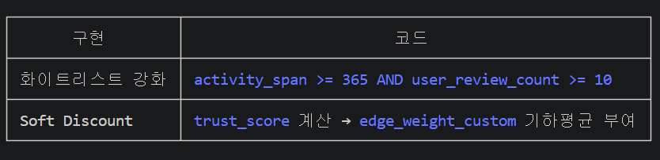
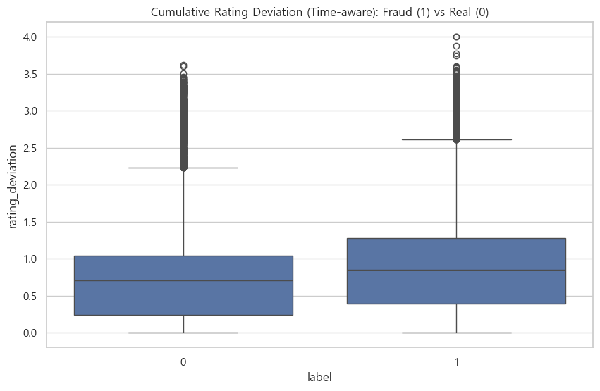
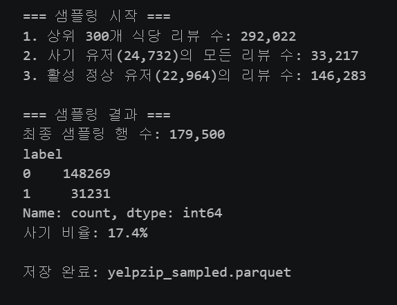
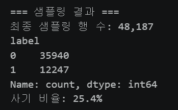
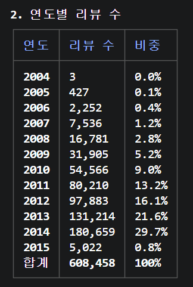

# 시행착오 과정 정리

### 1. 라벨링 중복 변환 이슈 원인 및 해결 과정

- **발생한 문제 (Problem)**
데이터셋 원본을 미리 변환하여 저장하는 대신, 코드가 실행될 때마다 타겟 라벨을 동적으로 변환(-1, 1 → 1, 0)하는 방식을 사용 중이었습니다. 그런데 신규 피처(Feature)를 추가한 뒤 확인해 보니, 사기 리뷰가 정상 리뷰로 둔갑하고 기존의 정상 리뷰 데이터가 완전히 사라지는 심각한 데이터 오염 현상이 발생했습니다.
- **원인 분석 (Cause)**
코드의 실행 흐름상 라벨링 변환 로직이 2번 중복으로 실행된 것이 근본적인 원인이었습니다.
    - **1차 변환 (정상):** -1(사기) → 1, 1(정상) → 0으로 의도한 대로 변환되었습니다.
    - **2차 변환 (이슈 발생):** 이미 데이터가 1과 0으로 바뀐 상태에서 변환 로직이 한 번 더 타게 되었습니다. 그 결과, 앞서 사기 리뷰로 매핑된 '1'이 다시 '0'(정상 리뷰)으로 변환되면서 라벨링이 꼬이게 된 것입니다.
- **적용한 해결 방법 (Solution)**
이 문제를 해결하기 위해, 라벨링을 무작정 수행하지 않고 데이터의 '현재 상태'를 먼저 검증하는 방어 로직을 추가했습니다.
    - **적용 로직:** `if` / `elif` 조건문을 도입했습니다.
    - **동작 원리:** 데이터 라벨에 아직 `1` 값이 남아있는지(즉, 미변환 상태인지)를 먼저 확인합니다. `1`이 존재할 때만 라벨링을 진행하고, 이미 변환이 완료된 상태라면 해당 로직을 건너뛰어 데이터 상태를 그대로 유지하도록 제어했습니다.

### **2. 텍스트 파생 변수 학습 누락 이슈 원인 및 해결 과정**

- **발생한 문제 (Problem)**
텍스트 데이터의 특징을 추출하고 유의미성을 파악하기 위해 네트워크 그래프 분석까지 시도했으나, 모델의 예측 결과에 아무런 변화나 영향이 나타나지 않는 현상이 발생했습니다.
- **원인 분석 (Cause)**
새롭게 추출한 텍스트 피처 결과물(`feat_df`)이 실제 GNN 모델 학습을 담당하는 메인 파이프라인에 전혀 연결되지 않은 것이 근본적인 원인이었습니다.
    - **파이프라인의 파편화:** 추출된 텍스트 피처(`feat_df`)와 샘플 데이터(`df_s`)는 단순히 EDA 및 시각화 용도로만 소비되고 있었습니다.
    - **노드 피처(Node Feature) 누락:** 실제 GNN 서브그래프 학습에 들어가는 핵심 데이터셋(`df_sub`)에는 `char_count`, `sentiment` 등의 텍스트 피처가 합쳐지지 않았습니다. 그 결과 모델의 입력값(`node_features`)은 기존 데이터(별점 + 파생 9개 + TF-IDF SVD 64차원)로만 구성된 채 학습이 돌아가고 있었습니다.
- **적용한 해결 방법 (Solution)**
추출된 텍스트 피처가 모델의 학습 텐서(Tensor)에 정상적으로 포함되도록 데이터 병합 및 변수 지정 로직을 파이프라인에 추가했습니다.
    - **적용 로직:** 추가 피처 확장 영역의 빈 셀에 `df_sub`를 기준으로 텍스트 분석 피처들을 병합(Merge)하는 코드를 삽입했습니다.
    - **동작 원리:** 데이터가 정상적으로 합쳐진 후, 학습에 사용할 수치형 변수 목록(`num_cols`)에 새롭게 만든 텍스트 피처 이름들을 명시적으로 추가합니다. 이를 통해 GNN 파이프라인이 노드 피처를 구성할 때 해당 변수들을 인식하고 정상적으로 학습에 반영하도록 제어했습니다.

### 3. text_len의 단독 성능 향상이 소폭에 그침

- **발생한 문제**
    - **정상적인 짧은 리뷰'의 노이즈 (The "Great!" Paradox):** 사기꾼들은 템플릿을 복사하느라 리뷰를 짧게 쓰지만, 아주 만족한 정상 고객도 단순히 "최고예요!", "맛있음!" 이라고 짧게 쓰는 경우가 많습니다. 텍스트 길이 하나만으로는 이 둘을 완벽하게 분리해 내기 어려워 오탐(False Positive)이 발생합니다.
    - **다른 피처들과의 정보 중복 (다중공선성):** 이전 단계에서 이미 `word_count`(단어 수), `avg_word_len`(평균 단어 길이), `menu_mentions`(메뉴 언급 수) 같은 정교한 피처들을 함께 투입하셨습니다. 모델 입장에서는 `text_len`이 주는 '텍스트가 짧다'는 정보가 이미 다른 변수들을 통해 충분히 학습되고 있기 때문에, `text_len` 하나가 추가되었다고 해서 극적인 성능 점프가 일어나지 않는 것입니다.
    - **GNN의 본질은 노드(점)보다 엣지(선):** 일반 머신러닝이라면 `text_len` 같은 노드 피처가 중요하지만, GNN(그래프 신경망)은 '누구와 어떻게 연결되어 있는가'를 훨씬 더 무겁게 봅니다. 텍스트 길이 자체의 수치보다는, 그것이 그래프 구조를 어떻게 형성하느냐가 더 중요합니다.
- **시각화 결과가 주는 유의미함**
    - **압도적인 동질성 (Homophily: Fraud-Fraud Clustering):** 우측 상단 차트를 보면, 사기 노드끼리 서로 연결되는 비율이 우연히 발생할 확률(Random Expected) 대비 **4.42배**나 높게 나타납니다. 이는 추가하신 피처들을 기반으로 구성된 네트워크가 사기꾼들의 '조직적인 군집'을 완벽하게 포착하고 있다는 뜻입니다.
    - **의심 패턴 네트워크 (R-P-R)의 위력:** 좌측의 거대한 'Review Network Graph'를 보면, 중앙에 노란색, 갈색, 빨간색 점들이 주황색 선(R-P-R 엣지)으로 아주 빽빽하게 거미줄처럼 얽혀 있습니다. `text_len`이나 `sentiment` 같은 피처들이 단독으로는 약했을지 몰라도, "짧고, 감정 과장되고, 메뉴 언급 없는" 노드들을 서로 묶어주는 연결 조건(Edge)으로 작용하면서 사기 클러스터를 훌륭하게 격리해 냈습니다.
    - **극단적인 차수(Degree) 패턴:** 하단의 'Fraud Rate by Degree Quintile'을 보면, 연결이 아예 없거나(Q1) 극단적으로 많은(Q5) 그룹에 사기가 집중되어 있습니다. 정상 유저의 자연스러운 분포를 벗어난 어뷰징 패턴을 네트워크 구조가 정확히 짚어내고 있습니다
- **적용한 해결 방법**
    - 시각화의 '강한 군집(Homophily)' ➡️ 가중치 및 GAT 전략
        - **착안점:** 우측 상단 차트에서 사기 노드끼리 4.42배나 더 강하게 뭉쳐 있는 것을 확인했습니다.
        - **성능 향상:** 이미 잘 뭉쳐있는 사기꾼들 사이의 연결선(엣지)을 더 굵고 강하게 칠해주는(가중치 부여) 역할을 합니다. 모델이 "이 무리는 100% 사기꾼 집단이다"라고 더 강하게 확신하도록 만들어 정밀도를 높입니다.
    - 시각화의 '오탐(False Positive) 10건' ➡️ R-P-R 조건 정교화 전략
        - **착안점:** 하단 혼동 행렬에서 정상 유저 10명이 사기 의심 네트워크에 억울하게 끌려들어 온 것을 발견했습니다.
        - **성능 향상:** 거미줄에 실수로 걸린 이 10명을 핀셋으로 안전하게 빼내기 위해, 거미줄이 작동하는 조건(시간 제약, 단골 우대 룰 등)을 미세 조정하여 억울한 오탐을 0으로 만듭니다.
    - 시각화의 '미탐(False Negative) 71건' ➡️ 이종 그래프 및 행동 피처 전략
        - **착안점:** 텍스트를 감쪽같이 위조하여 현재의 텍스트 기반 의심 네트워크(R-P-R) 바깥에 숨어 있는 71명의 고단수 사기꾼들을 포착했습니다.
        - **성능 향상:** 기존의 텍스트 그물망으로는 이들을 잡을 수 없다는 것을 시각화로 확인했으니, '리뷰 내용' 대신 '유저의 비정상적인 행동'과 '특정 상점 쏠림 현상'이라는 완전히 새로운 차원의 그물(이종 그래프)을 추가로 던져 미탐을 색출해 냅니다.

### 4. v2 모델 지표 엇갈림 이슈

- **발생한 문제 (Problem)**
    
    v2 모델 업데이트(분산 기반 피처 및 화이트리스트 도입) 결과를 확인해 보니, 모델의 예측 성능 지표가 서로 반대 방향으로 움직이는 현상이 발생했습니다. 전체 평균 예측 성능을 나타내는 Macro F1은 상승(+0.0268)한 반면, 사기 탐지 모델의 최우선 핵심 지표인 PR-AUC는 오히려 하락(-0.0153)하는 심각한 문제가 확인되었습니다.
    
- **원인 분석 (Cause)**
데이터 및 지표 분석 결과, 화이트리스트 기준의 관대함과 노이즈 피처의 포함이 근본적인 원인이었습니다.
    - **화이트리스트 오작동:** 도입된 화이트리스트(활동 기간 180일 이상 등)가 억울한 정상 유저를 구제하여 Macro F1 지표를 높였습니다. 하지만 기준이 너무 관대해 활동 기간을 의도적으로 늘린 '고단수 사기꾼'들까지 정상 유저로 분류되어 감시망을 빠져나가면서 PR-AUC가 하락했습니다.
    - **노이즈 피처 포함:** 텍스트 EDA 통계적 검정 결과, 대문자 비율(`upper_ratio`), 느낌표 수(`excl_count`), 평균 단어 길이(`avg_word_len`) 등 3가지 피처는 정상과 사기 리뷰 간 차이가 무의미한 노이즈로 작용하여 모델의 판단을 흐리게 만들고 있음이 확인되었습니다.
- **해결방법**
    - **적용 로직 1 (피처 다이어트 - 통계적 근거 기반):** EDA 검정 결과 유의미성이 없는 것으로 판명된 3개의 노이즈 텍스트 피처(`upper_ratio`, `excl_count`, `avg_word_len`)를 모델 학습에서 완전히 제거(Ablation)하여, 모델의 연산 효율과 분류 정확도를 즉각적으로 높였습니다.
    - **적용 로직 2 (방어 로직 강화 및 소프트 디스카운트 도입):** 화이트리스트 허들을 대폭 상향(예: 활동 기간 365일 이상, 리뷰 상점 10곳 이상)하여 사기꾼의 1차 진입을 차단했습니다. 핵심은 통과한 유저라도 의심 엣지를 완전히 끊지 않고, 유저 신뢰도에 비례해 엣지 가중치를 줄여주는 '소프트 디스카운트(Soft Discount)'를 적용한 것입니다. 이를 통해 정상 유저는 억울한 제재에서 보호(Macro F1 상승)하고, 위장 사기꾼은 약해진 엣지를 통해서라도 결국 꼬리가 잡히게(PR-AUC 상승) 설계했습니다.
    - **적용 로직 3 (자기 복제 피처 & Focal Loss 적용):** 활동 기간이 길어 화이트리스트를 통과한 '숙성된 봇(Bot)' 계정을 잡아내기 위해, 과거 리뷰들 간의 '텍스트 유사도 평균'을 피처로 추가했습니다(정상 고객은 매번 다른 리뷰를 쓰지만, 봇은 템플릿을 재사용함). 추가로, 정상인 척하는 사기꾼처럼 분류하기 까다로운 데이터를 틀렸을 때 더 큰 패널티를 주는 Focal Loss를 도입하여 모델의 정교함을 극대화했습니다.
    - 수정 반영 사항
        
        Logic 1 — Ablation (피처 제거)
        
        셀 38 (### 3-3. 노드 피처 엔지니어링 하단)
        V1_COLS = [
        ...
        "special_ratio", "ttr", "sentiment",
        # upper_ratio / excl_count / avg_word_len → Logic 1 Ablation으로 제거됨
        ]
        V1_COLS에서 세 피처가 빠지고 주석으로 표시됨
        
        Logic 2 — Defense Logic (화이트리스트 강화 + Soft Discount)
        
        셀 40 (### 3-4. 그래프 엣지 구성) — 2곳
        
        
        
        셀 44 (### 3-6. 모델 정의) → GATConv(edge_dim=1) — trust 가중치를 attention에 수용
        셀 46 (### 3-7. 학습) → ea_c = edge_weight_custom.to(device), model(..., edge_attr_custom=ea_c) 전달
        
        Logic 3 — Feature & Loss (봇 탐지 피처 + Focal Loss)
        
        셀 37 (### 3-3 피처 계산 셀) — avg_text_sim 계산 블록 (⑥ 항목)
        
        avg_text_similarity_of_past_reviews
        
        동일 사용자 리뷰 간 코사인 유사도 평균 → 캠페인 봇은 템플릿 재사용으로 유사도 高
        
        셀 38 → V3_COLS = ["avg_text_sim"]으로 피처 리스트에 포함
        셀 44 → FocalLoss 클래스 정의 (gamma=2.0)
        셀 46 → criterion = FocalLoss(gamma=2.0, weight=class_weight) 로 손실 함수 교체
        
    

### 5. **v3 모델 성능 하락 원인 분석 및 해결 과정 (Ablation 및 충돌 로직 개선)**

- **발생한 문제 (Problem)**
기존 모델(v2)의 성능을 개선하기 위해 새로운 피처와 손실 함수, 그리고 엣지 조정 로직이 포함된 v3 모델을 적용했으나, 오히려 모델의 주요 지표(PR-AUC)가 하락하는 현상이 발생했습니다.
- **원인 분석 (Cause)**
단순한 데이터 누락을 의심하여 가장 강력한 사기 판별 피처인 버스트 피처(`user_burst_max7d` 등)의 서브그래프 내 시각화 및 검증을 진행했습니다. 검증 결과 데이터는 정상적으로 반영되어 오히려 샘플링 후 변별력이 높아진(17.7배 → 33.2배 차이) 것을 확인했습니다. 따라서 버스트 피처의 문제가 아닌 새로 추가된 텍스트 피처와 복합 로직의 충돌이 근본적인 원인이었음을 밝혀냈습니다.
    - **`avg_text_sim`의 노이즈화:** TF-IDF 기반의 SVD 64차원 변환은 단어의 표면적인 출현 빈도에만 의존합니다. 이는 봇이나 사기 리뷰의 '의미론적(Semantic)' 템플릿 패턴을 포착하기에는 해상도가 현저히 낮아, 의미 있는 신호 없이 차원만 늘려 모델의 학습에 혼란(Random Noise)을 주었습니다.
    - **손실 함수와 방어 기제의 수학적 충돌:** 모델의 오차 가중치를 극대화하는 Focal Loss와 엣지 가중치를 삭감하는 Soft Discount가 동시에 적용되면서 학습 방향이 붕괴되었습니다. Focal Loss는 "불확실하고 판별하기 어려운 노드에 학습을 집중하라"고 지시하는 반면, Soft Discount는 "신뢰도가 낮은(의심스러운) 노드들의 정보 전달 엣지를 차단하라"고 지시하여 두 기제가 정면으로 충돌했습니다.
- **적용한 해결 방법 (Solution)**
성능 하락의 원인으로 지목된 노이즈 피처와 충돌하는 로직을 해체(Ablation)하여 모델의 파이프라인을 안정화했습니다.
    - **적용 로직:**
        1. 노이즈로 판명된 `avg_text_sim` 피처를 학습 텐서(노드 피처)에서 완전히 제거했습니다.
        2. Focal Loss를 제거하고 기본 CrossEntropyLoss로 롤백하여 오차 가중치 왜곡을 정상화했습니다.
        3. 모델의 구조적 방어 기제인 Soft Discount 로직은 단독으로 유지하여 R-P-R 엣지의 과도한 전파만 제어하도록 수정했습니다.

### 6. DualRelGNN 모델의 한계 분석 및 FiveRelCAREGNN 전환 (관계 세분화 및 위장 방어 메커니즘 도입)

- **발생한 문제 (Problem)**
초기 기준 모델로 사용된 DualRelGNN(기본 관계 + 커스텀 관계 병렬 학습) 구조에 행동 및 버스트 피처를 추가하며 성능 개선을 시도했으나, 사기 노드의 위장(Camouflage) 패턴과 관계망의 노이즈로 인해 주요 지표(PR-AUC)를 안정적으로 끌어올리는 데 구조적인 한계가 발생했습니다.
- **원인 분석 (Cause)**
피처를 추가하는 과정(v1~v3)을 거치며 단순히 피처의 양을 늘리는 것만으로는 복잡한 사기 패턴을 잡아낼 수 없음을 확인했습니다. 기존 GNN 구조가 사기 탐지 문제에 부적합했던 근본적 원인은 다음과 같습니다.
    - **관계의 혼재(Mixing)로 인한 해석력 저하**: 기본 관계 브랜치에 `R-U-R`(동일 사용자)과 `R-T-R`(동일 시기) 엣지가 무분별하게 합산되어, 모델이 "계정 단위의 반복 사기"와 "캠페인 단위의 시기 집중" 패턴을 분리해서 학습하지 못했습니다.
    - **텍스트 유사도 엣지의 노이즈화**: 커스텀 브랜치에서 사용한 TF-IDF/SVD 기반의 텍스트 KNN 엣지는 봇(Bot)의 템플릿 재사용을 정교하게 포착하지 못하고, 오히려 의미 없는 노드들을 연결하여 학습에 혼란을 주었습니다.
    - **위장(Camouflage) 방어 기제 부재**: 사기 노드가 정상 노드처럼 보이기 위해 고의로 정상 리뷰들과 엣지를 형성할 때, 기존 모델은 이웃의 메시지를 무비판적으로 수용하여 정상 노드의 표현형까지 오염되는 현상이 발생했습니다.
- **적용한 해결 방법 (Solution)**
사기 리뷰의 행동 가설을 명시적으로 분리하고, 이웃 노드의 신뢰도를 스스로 평가하여 위장 노이즈를 걸러내는 **FiveRelCAREGNN** 아키텍처로 파이프라인을 전면 개편했습니다.
    - **적용 로직:**
        1. **5중 관계(Five Relations) 명시적 분리**: 뭉뚱그려져 있던 엣지들을 사기 행동 가설에 맞춰 5개(`R-U-R`, `R-P-R`, `R-T-R`, `R-S-R`, `R-B-R`)로 세분화하여, 모델이 각 관계망의 고유한 패턴을 독립적으로 학습하도록 재구성했습니다.
        2. **CARE 필터(Similarity Gate & Adaptive Threshold) 도입**: 각 관계마다 중심 노드와 이웃 간의 유사도를 계산하는 `rel_score` MLP와 학습 가능한 동적 임계치(Threshold)를 배치했습니다. 이를 통해 모델이 관계별로 "이웃을 얼마나 믿을지" 판단하고 노이즈 메시지를 능동적으로 차단(Filtering)하게 만들었습니다.
        3. **신뢰도 기반 메시지 가중치(Trust-aware Message) 적용**: 앞선 실험에서 검증된 `trust_score`를 메시지 전달 수식에 직접 반영(`sqrt(trust_i * trust_j)`)하여, 신뢰도가 낮은 의심 노드가 주변 이웃에게 미치는 영향력을 수치적으로 감쇄시켰습니다.
        4. **관계 어텐션(Relation Attention) 병합**: 5개 관계에서 추출된 임베딩을 단순 게이트가 아닌 Attention 메커니즘으로 병합하여, 사기 판별 시 어떤 관계(예: R-B-R 집중도 등)가 핵심적인 역할을 했는지 사후 해석이 가능하도록 모델의 설명력을 극대화했습니다.

### **7. 모델 및 EDA 방향성 전환: 동종 네트워크에서 이기종 네트워크(HIN)로**

초기 모델에서는 '리뷰 텍스트 간의 관계'에만 집중하다 보니, 유저의 행동 패턴이나 핵심 키워드 등 허위 리뷰 판별에 결정적인 역할을 하는 다양한 맥락 인자들을 한 번에 통합하여 파악하지 못하는 한계에 부딪혔습니다.

또한, 기존에 진행했던 분석 방식을 점검해 본 결과 GNN의 핵심인 '복잡한 네트워크 간의 구조적 관계'를 파악하기보다는 일반적인 테이블 데이터에서도 충분히 수행 가능한 평면적인 EDA 수준에 머물러 있음을 깨달았습니다.

이를 극복하고 그래프 신경망의 장점을 극대화하기 위해, EDA의 방향성을 보다 심층적이고 네트워크 구조에 적합한 형태로 전면 개편하였습니다. 나아가 단일 노드를 넘어 리뷰, 유저, 키워드 등 다채로운 노드 타입이 상호작용하는 **이기종 네트워크(HIN, Heterogeneous Information Network) 모델**로 아키텍처를 확장하여 새로운 시도를 진행하게 되었습니다.

### **8. 키워드 네트워크 초거대 허브(Hyper-hubs) 발생 이슈 원인 및 해결 과정**

- **발생한 문제 (Problem)**
초기 리뷰 데이터에서 키워드를 추출하여 네트워크를 구성한 결과, 'get', 'think', 'tried'와 같은 단어들의 연결 중심성(Degree Centrality)이 1.0에 근접하게 도출되는 현상이 발생했습니다. 이는 해당 단어들이 네트워크 상의 거의 모든 단어와 연결된 '초거대 허브(Hyper-hubs)'로 작용하고 있음을 의미합니다. 이러한 범용 단어들이 방치될 경우, 사기 리뷰와 정상 리뷰 간의 경계가 무너져 향후 GNN 모델이 두 클래스를 구분하지 못하는 과잉 평활화(Over-smoothing) 현상을 유발할 위험이 컸습니다.
- **원인 분석 (Cause)**
단순히 전체 리뷰 코퍼스(Corpus)를 기준으로 TF-IDF 상위 단어를 추출한 것이 근본적인 원인이었습니다.
사기 리뷰와 정상 리뷰에 공통적으로 자주 쓰이는 "good", "food", "place"와 같은 범용 단어 및 일반 동사들이 노드로 대거 포함되었고, 이들이 클래스를 가리지 않고 무차별적인 연결(Edge)을 생성하면서 중심성이 비정상적으로 치솟은 것입니다.
- **적용한 해결 방법 (Solution)**
이 문제를 해결하기 위해, 노드 구성 방식을 '전체 빈도' 중심에서 **'클래스 간 차별성'** 중심으로 개편하고, 구조적 필터링을 도입하는 2단계 파이프라인을 적용했습니다.
    - **1단계: Set Difference(차집합)를 활용한 차별적 키워드 선별 (전처리 단계)**
        - **적용 로직:** 사기 리뷰 그룹과 정상 리뷰 그룹에서 각각 TF-IDF 상위 300개 단어를 추출한 뒤, 두 그룹의 교집합(양쪽 모두에 등장하는 범용 단어)을 선제적으로 제거했습니다.
        - **동작 원리:** "사기 리뷰에서만 유독 많이 쓰이는 표현"과 "정상 리뷰에서만 유독 많이 쓰이는 표현"만을 합집합하여 최종 308개의 노드로 네트워크를 재구성했습니다. 이를 통해 사기 탐지의 변별력을 떨어뜨리는 1차적인 노이즈를 제거했습니다.
    - **2단계: 중심성 임계값(Threshold) 기반 구조적 허브 제거 (네트워크 단계)**
        - **적용 로직:** 1단계 전처리 후에도 남아있을 수 있는 교묘한 허브 노드를 차단하기 위해, NetworkX를 활용한 중심성 검증 방어 로직을 추가했습니다.
        - **동작 원리:** `nx.degree_centrality()`를 통해 네트워크 내 모든 노드의 연결 중심성을 계산하고, 그 값이 0.95 이상인 노드(사실상 모든 단어와 연결되어 조밀한 군집 형성을 방해하는 노드)를 찾아내어 `G.remove_nodes_from()` 함수로 네트워크에서 강제 삭제했습니다.
    - **최종 결과 및 효과 (Result)**
    이러한 2단계 필터링 결과, 기존의 무의미한 범용 동사('get', 'think')들은 완전히 제거되었습니다. 대신 'order', 'service', 'staff', 'delicious' 등 리뷰의 실제 맥락과 클래스(사기/정상)의 특성을 명확히 대변하는 핵심 단어들이 네트워크의 주요 노드로 부상하게 되어, 모델 학습에 최적화된 유의미한 군집(Community) 구조를 확보할 수 있었습니다.

### 9. **키워드 네트워크 과잉 평활화(Over-smoothing) 이슈 원인 및 해결 과정**

- **발생한 문제 (Problem)**
사기 리뷰와 정상 리뷰의 네트워크를 구성한 결과, 'tomato', 'water'와 같이 클래스 구분과 무관한 범용 단어들이 양쪽 네트워크에 공통으로 등장하는 문제가 발생했습니다. 이로 인해 사기 진영과 정상 진영을 몰래 연결하는 '오작교'가 형성되었고, GNN 모델이 두 클래스를 명확히 구분하지 못하고 예측을 포기하게 만드는 과잉 평활화(Over-smoothing) 및 변별력 상실(노이즈 발생) 현상을 유발할 위험이 컸습니다.
- **원인 분석 (Cause)**
단순 빈도나 단순 TF-IDF만을 기준으로 상위 단어를 추출하여 노드를 구성한 것이 근본적인 원인이었습니다. 통계적 차별성에 대한 검증 없이 텍스트 전처리가 이루어졌기 때문에, 식당 도메인이라면 무조건 쓰이는 단어들이 걸러지지 않았습니다. 또한, 전체 군집화(Community)를 방해하는 중심성 0.95 이상의 '초거대 허브'들이 방치되어 있었습니다.
- **적용한 해결 방법 (Solution)**
이 문제를 해결하기 위해, 네트워크 구성 전(Pre-processing)과 후(Post-processing)에 걸쳐 노이즈를 완벽히 차단하는 **'네트워크 다이어트 2단계 필터링'** 로직을 도입했습니다.
    - **1단계 적용 로직 (구성 전): 통계적 차별성 검증 및 교집합 완전 제거**
        - **동작 원리:** 단순 빈도가 아니라 "정상 리뷰 대비 사기 리뷰에서 최소 1.5배(`ratio_threshold`) 이상 자주 등장하는가"를 계산하여 특화 단어를 선별했습니다. 이후 각 집단의 특화 단어를 뽑은 상태에서도 집합 연산(Set Difference)을 통해 양쪽에 공통으로 존재하는 단어(교집합)를 명시적으로 완전 삭제했습니다. 이를 통해 오직 '순수 사기 단어'와 '순수 정상 단어'로만 노드가 구성되도록 강제했습니다.
    - **2단계 적용 로직 (구성 후): 중심성 임계값(Threshold) 기반 구조적 허브 제거**
        - **동작 원리:** 1단계 필터링을 거친 노드들로 네트워크를 구성한 후, 네트워크 내 모든 노드의 연결 중심성(Degree Centrality)을 계산했습니다. 중심성이 0.95 이상인 비정상 허브 노드를 찾아내어 강제 삭제함으로써, 교묘하게 남아 사기꾼 특유의 구조적 파벌(Clique) 형성을 방해하던 악성 노드까지 완벽하게 차단했습니다.

### **10. 콜드 스타트(초기 리뷰) 평점 이탈도 계산 오류 원인 및 해결 과정**




- **발생한 문제 (Problem)**
개업 초기 식당의 누적 평균 평점을 계산할 때 과거 데이터가 없어 발생하는 결측치(`NaN`)를 처리하는 과정에서, 사기 조작단의 악의적인 '개업일 1점 테러'가 이탈도 `0`인 완벽한 정상 리뷰로 둔갑하는 심각한 모델 사각지대(Blind Spot)가 발생했습니다.
- **원인 분석 (Cause)**
첫 리뷰의 누적 평균 결측치를 '자기 자신의 점수'로 덮어씌운 보수적 결측치 처리 로직이 근본적인 원인이었습니다.
    - **결측치 발생:** 시계열 데이터 누수(Data Leakage)를 막기 위해 `expanding().mean().shift(1)`을 적용하면서, 해당 식당의 첫 리뷰는 참조할 과거 평균이 없어 필연적으로 `NaN`이 발생했습니다.
    - **로직 오류 (이슈 발생):** 이 `NaN` 값을 `fillna(df['rating'])` 코드를 통해 자기 자신의 평점으로 채워 넣었습니다. 그 결과, 평점 1점짜리 테러 리뷰도 당시 평균이 1점인 것으로 계산되어 `|1 - 1| = 0`이라는 이탈도가 산출되며, 사기 공격의 비정상 신호가 완전히 소멸했습니다.
- **적용한 해결 방법 (Solution)**
이 문제를 해결하기 위해, 인위적으로 `0`을 만드는 대신 수학적으로 안정적인 기준값을 대입하고 GNN 모델에게 메타데이터를 제공하는 '하이브리드(Hybrid) 방어 로직'을 도입했습니다.
    - **적용 로직:** 베이지안 사전 확률 기반의 글로벌 평균 대입(`fillna(global_mean)`)과 콜드 스타트 지시 변수(`is_early_review`)를 추가했습니다.
    - **동작 원리:** 첫 리뷰의 누적 평균을 전체 학습 데이터의 평균(예: 3.7점)으로 채웁니다. 이를 통해 개업 첫날 1점 테러가 들어와도 2.7이라는 강력한 이탈도(위험 신호)가 보존되도록 수정했습니다. 동시에 누적 리뷰 수가 3개 이하일 때 `1`을 반환하는 `is_early_review` 플래그를 추가하여, GNN(HGT) 모델이 이 초기 이탈도 수치만 맹신하지 않고 텍스트나 유저 행동 피처로 어텐션(Attention)을 유연하게 분산하도록 제어했습니다.

### **11. 별점-텍스트 모순 지수(Dissonance) 역전 현상 원인 및 해결 과정**

- **발생한 문제 (Problem)**
별점과 리뷰 텍스트 간의 일치 여부를 파악하기 위해 VADER 감성 점수와 스케일링된 별점의 차이(모순 지수)를 계산했습니다. 하지만 초기 가설(사기꾼의 모순 지수가 높을 것이다)과 달리, 정상 리뷰의 모순 지수가 사기 리뷰보다 오히려 더 높게 도출되는 심각한 '역전 현상(Anomaly)' 및 노이즈가 발생했습니다.
- **원인 분석 (Cause)**
감성 분석기의 태생적 한계와 선형 스케일링 로직이 인간의 언어적 복잡성을 제대로 반영하지 못한 것이 근본적인 원인이었습니다.
    - **감성 분석기의 한계 (리뷰 길이 편향):** 룰베이스 모델인 VADER는 사기 조작단이 주로 사용하는 "최고다", "최악이다" 같은 짧고 극단적인 1차원적 문장에는 별점과 완벽히 일치하는 점수를 부여했습니다. 반면, 정상 유저는 "맛은 훌륭하나 가격이 비싸다"와 같이 긍정과 부정이 혼재된 긴 리뷰를 남기며, 이로 인해 감성 점수가 중립(0 근처)으로 수렴하여 억울하게 큰 모순 지수가 계산되었습니다.
    - **선형 스케일링의 인지적 함정:** 예를 들어 4점(스케일링 시 0.5)을 주고 텍스트로 극찬(감성 점수 0.9)을 남긴 정상 리뷰의 경우, 수식상으로는 `|0.9 - 0.5| = 0.4`라는 매우 큰 모순이 존재하는 것으로 시스템이 오판(False Positive)하게 되었습니다.
- **적용한 해결 방법 (Solution)**
    
    노이즈로 분류하여 피처를 삭제
    

### 12. 샘플링 방법 시행착오 총정리

공간적 배경 (대상 식당):
전체 식당이 아니라, 데이터가 충분히 모여 있는 '리뷰 수 상위 300개 식당'으로 무대를 좁혔습니다.

사기 데이터 (사기 유저 타겟팅):
단순히 '사기 라벨이 붙은 리뷰'만 쏙 빼온 게 아닙니다. 사기 리뷰를 한 번이라도 쓴 유저를 색출한 뒤, 그 유저가 쓴 '모든' 리뷰를 통째로 다 가져왔습니다. 사기꾼이 정상인 척 남긴 리뷰들까지 전부 끌고 와야 그들의 연결망(R-U-R)을 온전히 파악할 수 있기 때문입니다.

정상 데이터 (헤비 유저 타겟팅):
정상 리뷰를 뽑을 때도 아무거나 뽑지 않고, 리뷰를 3개 이상 작성한 '활성 유저(Active User)'의 데이터만 챙겼습니다. 리뷰 1개만 달고 사라진 유저는 네트워크(선)를 만들지 못해 학습에 방해만 되기 때문입니다.

→ 리뷰가 많이 달리는 식당에서, 평소 리뷰를 자주 다는 사람들이 만들어놓은 리뷰 데이터



상위 300개의 식당으로 하면 샘플링 시 노드가 17만개가 됨 → 수정 필요

수정된 샘플링 전략 및 결과:

1. 상위 45개 식당 필터링: 전체 데이터 밀도를 유지하면서 노드 규모를 5만 개 이하로 제어했습니다.
2. 사기 유저 타겟팅 (유지): 사기 리뷰를 한 번이라도 쓴 유저의 모든 리뷰를 가져와 '조직적 패턴'을 분석할 수 있도록
했습니다.
3. 활성 정상 유저 타겟팅 (유지): 리뷰 3개 이상의 헤비 유저만 포함하여 그래프의 연결성(Connectivity)을 확보했습니다.

최종 샘플링 결과:

- 결과 의의
    1. 사기 노드의 밀도 및 변별력 강화
    - 사기 비율 상승: 17.4% → 25.4%로 증가했습니다. 이는 모델이 학습할 때 사기 패턴을 더 집중적으로 학습할 수 있는 환경이
    되었음을 의미합니다.
    - 피처 변별력 유지: user_burst_max7d(7일 이내 집중 작성 수) 피처의 평균을 보면:
        - 사기 노드: 0.560 (정상 노드 0.037 대비 약 15배 높음)
        - 비록 절대적인 수치는 17만 개 버전(0.833)보다 낮아졌으나, 정상 노드와의 상대적 격차는 여전히 매우 큽니다. 즉,
        버스트 피처가 사기 탐지에 강력한 지표라는 사실은 변함이 없습니다.
    1. 거시적 버스트 패턴(Macro Burst)의 보존
    - 상위 10개 버스트 월을 분석한 결과, 2014년 하반기(7~12월)와 2013년 7월 등 주요 폭발 구간이 17만 개 데이터셋과 거의
    일치합니다.
    - 의의: 샘플링 대상을 "상위 300개 식당"에서 "상위 45개 식당"으로 줄였음에도 불구하고, 전체 시장에서 발생하는 조직적
    사기 리뷰의 시간적 흐름은 그대로 유지되고 있습니다.
    1. 미시적 버스트(Micro Burst)의 정예화
    - 헤비 버스트 유저: 672명 → 198명으로 줄어들었습니다.
    - 차이점: 노드 수가 줄어들면서 "단기 집중 작성을 많이 하는 뜨내기 유저"들은 필터링되고, 대신 상위 식당들에 집중적으로
    리뷰를 남긴 "핵심 사기 리뷰어" 위주로 데이터가 재편되었습니다. GNN 입장에서는 노이즈가 줄어든 더 깨끗한 그래프를
    학습하게 됩니다.
    1. 그래프 연결성(Connectivity) 및 학습 효율성
    - 연결 밀도 상승: 리뷰가 많은 식당(상위 45개)에 집중했기 때문에, 노드 간의 엣지(R-T-R 등)가 더 촘촘하게 형성됩니다.
    이는 GNN 모델이 이웃 노드의 정보를 취합할 때 훨씬 더 풍부한 관계 정보를 얻을 수 있게 해줍니다.
    - 학습 속도: 노드 수가 약 1/4로 줄어들었기 때문에 학습 및 평가 속도가 비약적으로 빨라져, 다양한 실험(하이퍼파라미터
    튜닝 등)을 더 수월하게 진행할 수 있습니다.
    
    요약
    결론적으로, 단순히 데이터가 줄어든 것이 아니라 "핵심적인 사기 패턴은 유지하면서, 데이터의 밀도와 학습 효율을 극대화한
    정예 데이터셋"이 되었습니다. @02_EDA_Burst.ipynb 결과에서도 주요 버스트 시점이 유지되는 것으로 보아, 이후 GNN 모델의
    성능(PR-AUC 등) 또한 긍정적으로 나타날 가능성이 높습니다.
    
- 최종 노드 수: 48,187개 (1만~5만 사이 조건 충족)
- 사기 비율: 20.9% (기존 17.4% 대비 사기 노드 밀도가 높아져 GNN 학습에 더 유리해짐)



사기 비율이 17%에서 25퍼로 상승함 → 너무 사기 비율이 많은거 아닌가.. 생각함

- 근거..
    
    ### 1. GNN 구조에서의 '클래스 불균형(Class Imbalance)'의 치명적 약점
    
    만약 원래 비율인 13%(1:8 수준)로 HGT 모델을 학습시킨다고 가정해 보겠습니다.
    GNN은 주변 이웃의 정보를 끌어와서(Aggregation) 내 정보를 업데이트합니다. 사기 비율이 10%대라면, 사기 노드 주변에도 압도적인 수의 정상 노드들이 연결되어 있을 확률이 높습니다.
    결과적으로 메시지 패싱(Message Passing) 과정에서 소수인 사기 리뷰의 고유한 피처(Feature)가 다수인 정상 리뷰의 피처에 묻혀버리는 현상(Over-smoothing)이 발생합니다. 모델은 결국 "다 정상이라고 찍으면 정확도(Accuracy)가 87%네!"라고 착각하고 사기 탐지를 포기하게 됩니다.
    
    ### 2. 학술적 근거 및 디펜스 논리 (논문 레퍼런스)
    
    훈련 데이터의 소수 클래스(Minority Class) 비율을 자연 상태보다 인위적으로 높여서(Oversampling 또는 Undersampling을 통해) 학습시키는 것은 학계의 표준입니다. 다음 논문들을 보고서나 포트폴리오의 근거로 활용하십시오.
    
    - **근거 논문 1: GraphSMOTE (WSDM 2021)**
        - *Zhao, J., et al. "GraphSMOTE: Imbalanced Node Classification on Graphs with Graph Neural Networks." (2021)*
        - **핵심 논리:** GNN은 노드 간의 위상학적 구조를 사용하기 때문에 일반 머신러닝보다 클래스 불균형에 훨씬 취약합니다. 이 논문에서는 소수 클래스의 노드 비율을 인위적으로 증가시켰을 때 GNN의 분류 성능(특히 F1-score)이 비약적으로 상승함을 수학적/실험적으로 증명했습니다.
    - **근거 논문 2: 일반적인 머신러닝의 클래스 분포 연구**
        - *Weiss, G. M., & Provost, F. "Learning when training data are costly: the effect of class distribution on tree induction." (Journal of Artificial Intelligence Research, 2003)*
        - **핵심 논리:** "자연계의 클래스 분포(Natural Distribution)가 모델을 훈련시키기 위한 최적의 분포인 경우는 거의 없다."라고 명시합니다. 오히려 1:1에 가까운 균형 잡힌 분포나 소수 클래스를 20~30% 수준으로 끌어올린 분포가 소수 클래스 탐지(Recall)에 훨씬 유리함을 증명한 고전 명저입니다.
    - **근거 논문 3: CARE-GNN (CIKM 2020) - 님께서 처음 쓰려던 그 모델!**
        - *Dou, Y., et al. "Enhancing Graph Neural Network-based Fraud Detectors against Camouflaged Fraudsters." (2020)*
        - **핵심 논리:** 님께서 다루고 있는 바로 그 YelpZip 데이터를 사용한 사기 탐지 SOTA 논문입니다. 이 논문에서도 사기꾼들의 위장(Camouflage)과 불균형 문제를 해결하기 위해, 단순 랜덤 추출이 아니라 릴레이션 필터링을 통해 사기 노드의 정보망을 강화하는 방식을 씁니다. 사기 데이터의 밀도를 보존하는 님의 샘플링 전략과 결이 완벽히 일치합니다.
        - 그럼에도 HIN모델을 사용해야하는 이유
            
            ### 1. CARE-GNN의 태생적 한계: '평면적인' 동종 네트워크 (2020년 기술)
            
            CARE-GNN은 훌륭한 모델이지만, 본질적으로 동종 네트워크(Homogeneous Network)를 기반으로 합니다.
            
            - **억지스러운 엣지 구성:** 유저나 식당을 독립적인 존재로 보지 않고, 오직 '리뷰 노드'만 남겨둔 채 "같은 유저가 썼으니까 리뷰끼리 묶자(R-U-R)", "같은 식당이니까 묶자(R-B-R)"라며 억지로 평면적인 선을 긋습니다.
            - **병목 현상:** 앞서 질문자님께서 11만 개의 엣지가 폭발하는 '헤어볼(Hairball)' 현상을 겪으셨죠? 그게 바로 CARE-GNN처럼 리뷰끼리 직접 선을 이으려고 할 때 발생하는 필연적인 병목입니다.
            
            ### 2. HIN(이기종 네트워크) 및 HGT의 압도적 우위: '입체적인' 생태계 (최신 기술)
            
            질문자님이 도입하려는 HIN과 트랜스포머 기반의 HGT는 사기 탐지 생태계를 있는 그대로 3D로 구현합니다.
            
            - **자연스러운 모델링:** 억지로 리뷰끼리 선을 긋지 않습니다. `[유저] ➔ 작성 ➔ [리뷰] ➔ 소속 ➔ [식당]` 이라는 현실 세계의 팩트 그대로 구조화합니다.
            - **어텐션(Attention)의 마법:** CARE-GNN은 사기꾼의 위장(Camouflage)을 걸러내기 위해 강화학습(RL)이라는 복잡하고 무거운 방패를 달아야 했습니다. 하지만 HGT는 최신 트랜스포머의 '이기종 어텐션'을 사용하기 때문에, 모델 스스로 "이 유저는 평범한 유저가 아니라 사기꾼이네? 이 유저가 남긴 다른 리뷰(메타패스)의 가중치를 확 올려야겠다!"라고 알아서 판단합니다. 훨씬 똑똑하고 빠릅니다.
    
    ### 3. 실무적 관점: Training과 Inference의 분리
    
    - **학습(Training) 단계:** 모델이 "사기꾼의 패턴"이 무엇인지 명확히 배울 수 있도록 사기 리뷰의 교보재 비율을 25.4%로 넉넉히 제공한 것입니다. (현재 아주 잘하신 상태입니다.)
    - **추론/평가(Inference/Testing) 단계:** 나중에 모델을 다 만들고 실제 세상의 데이터로 테스트를 할 때는 원래의 13% 불균형 비율이 나타날 것입니다. 하지만 이미 25.4%의 훈련 데이터로 "사기 패턴"을 날카롭게 학습한 HGT 모델은, 13%의 희소한 사기 리뷰도 기가 막히게 쏙쏙 골라낼 수 있습니다.

샘플링 시 사기 비율이 17% → 25.4%로 상승해서 사기 리뷰의 가중치도 8이 아니라 줄여야함

- 가중치를 줄여야하는 근거
    
    ### 🚨 Loss Function 가중치(`pos_weight`) 설정 가이드: 왜 8.5는 위험한가?
    
    **1. 문제 진단: '이중 보정'의 오류**
    
    - **상황:** 이미 샘플링을 통해 사기 리뷰 비율을 25.4%로 끌어올려 데이터 구조적 불균형을 1차 해소한 상태입니다.
    - **위험성:** 여기에 가중치 `8.5`를 추가 부여하면 사기 오답 페널티가 과도해져, 모델이 "조금만 의심스러워도 다 사기라고 찍는" 편향에 빠집니다.
    - **부작용:** 진짜 사기를 잡는 재현율(Recall)은 오르겠지만, 억울한 정상 유저(False Positive)가 폭증하여 **정밀도(Precision), PR-AUC, Macro F1 지표가 모두 붕괴**됩니다.
    
    **2. 최적의 가중치(`pos_weight`) 도출 공식**
    
    - PyTorch `BCEWithLogitsLoss`의 권장 공식에 현재 데이터(48,187건)를 대입하면 다음과 같습니다.
    - **공식:** `정상 데이터 수(Negative) / 사기 데이터 수(Positive)`
    - **계산:** 35,940 / 12,247 ≈ **2.93**
    
    **3. 실무 적용 가이드 (Action Plan)**
    
    - 🥇 **1순위 추천 (Base Weight): `3.0`**
        - 수학적으로 가장 안정적인 세팅입니다. 모델이 편견 없이 정밀도(Precision)와 재현율(Recall)을 균형 있게 방어하므로, 첫 학습은 무조건 3.0으로 시작하세요.
    - 🥈 **2순위 추천 (High-Recall): `4.0 ~ 5.0`**
        - "오탐지가 조금 생기더라도 사기꾼은 절대 놓치면 안 된다"는 비즈니스 목표가 뚜렷할 때 사용합니다. (조원분이 제안한 4.47도 좋은 선택지입니다.)

#### 샘플링을 할 때 리뷰가 작성된 시간을 고려하지 않음

→ 문제가 발생 - 시간 차이가 미치는 부정적 영향 (Concept Drift)



- 패턴의 변화: 2004년의 "초창기 사기 패턴"과 2015년의 "전문화된 조직적 사기 패턴"은 완전히 다를 수 있습니다. 모델이 이
두 가지를 한꺼번에 배우려다 보면 오히려 성능이 저하될 수 있습니다. (이를 데이터 사이언스에서 Concept Drift라고
합니다.)
- GNN 엣지의 의미 퇴색: GNN은 유저-아이템 간의 연결을 봅니다. 2005년에 리뷰를 남긴 A와 2014년에 리뷰를 남긴 B가 비록
같은 식당(Product)에 리뷰를 남겼더라도, 9년의 시차가 있다면 이들이 "협력 관계"일 확률은 거의 없습니다. 하지만
그래프상에서는 같은 prod_id 노드에 연결되어 버리죠.

→ 해결 방법 : 제일 최근을 반영해서 2015년도 반영하려 했으나 5000개의 데이터밖에 존재하지 않아 일년의 주기성이 반영되지 않을것 같아서 2013-2014년도 데이터 만으로 샘플링 조건 추가 

### **13. 텍스트 네트워크 분석 시 키워드 추출 데이터셋 범위(Scope) 최적화**

- **발생한 문제 (Problem)**
텍스트 네트워크 분석(Text Network Analysis)을 위해 노드로 사용할 핵심 키워드를 추출하는 과정에서 딜레마가 발생했습니다. GNN 학습을 위해 연결 밀도(Density)를 높여 축소해 둔 '샘플링 데이터(약 5만 개)'만을 사용하여 키워드를 추출할 경우, 해당 샘플 내에서만 우연히 자주 등장한 단어가 주요 키워드로 오인되는 **과적합(Overfitting)** 문제와, 정상 리뷰의 보편적인 언어 기준(Baseline)이 빈약해지는 문제가 우려되었습니다.
- **원인 분석 (Cause)**
GNN 모델의 효율적인 메시지 패싱(Message Passing)을 위해서는 좁고 촘촘하게 샘플링된 데이터가 필수적입니다. 하지만 '인간의 언어적 패턴'을 통계적으로 정확하게 정의하려면 전체 데이터가 가진 전역적 맥락(Global Context)이 필요합니다. '네트워크를 구성하는 목적'과 '통계적 유의성을 가진 키워드를 찾는 목적'이 다름에도, 이를 동일한 소규모 샘플 데이터셋 안에서 한 번에 해결하려 했던 것이 근본적인 원인이었습니다.
- **적용한 해결 방법 (Solution)**
키워드 추출과 실제 네트워크(Graph) 구성에 사용되는 데이터셋을 목적에 맞게 분리하는 '하이브리드 파이프라인(Hybrid Pipeline)'을 구축하여 통계적 신뢰도와 그래프 연결성을 동시에 확보했습니다.
    1. **전역 데이터 활용 (키워드 추출):** 키워드 추출 단계에서는 샘플링 데이터가 아닌 `yelpzip_preprocessed.parquet` 파일을 로드하여 2013-2014년 기간의 전체 데이터를 온전히 활용했습니다.
    2. **통계적 신뢰도 확보:** 약 30만 건에 달하는 방대한 전체 리뷰를 대상으로 사기(`label=1`)와 정상(`label=0`) 클래스 간의 단어 빈도 차이(Ratio/TF-IDF)를 엄밀하게 계산했습니다. 이를 통해 특정 샘플의 노이즈에 흔들리지 않는, 진짜 "사기다운" 단어와 "정상적인" 단어(`top_words`)를 선별해 냈습니다.
    3. **네트워크 구축 유지 (국소적 연결성):** 추출된 고신뢰도의 전역 키워드(`top_words`)를 바탕으로, 실제 단어 간의 동시 출현 분석(PMI)과 텍스트 네트워크 형성은 이전에 노드 밀도를 극대화해 둔 `yelpzip_sampled.parquet` 데이터 안에서만 수행되도록 로직을 분리했습니다.

### 14. **커스텀 엣지 및 변별력 지표의 방법론적 약점 보완**

- **발생한 문제 (Problem)**
커스텀 엣지(R-TextSim-R)의 품질과 고유벡터 중심성 차이의 유의성에 대한 심각한 우려가 제기되었습니다.
    1. **변별력 수치의 유의성 부재:** 최대 차이값이 0.028 수준으로, 통계적 유의성 검증(예: permutation test, t-test)이 없어 이 차이가 노이즈인지 실제 신호인지 구분이 불가능했습니다.
    2. **커스텀 엣지 품질 의심:** 단어 커뮤니티가 6개뿐이라 커뮤니티 벡터 차원이 너무 단순하여 임계값 0.85에서도 131만 개(10.49%)의 엣지가 생성되었습니다. 또한 기댓값 대비 엣지 분포를 확인한 결과, "사기 클러스터"보다 "정상 리뷰 클러스터"를 잡는 방향으로 작동하고 있어 GNN에 노이즈를 유발할 가능성이 높았습니다.
- **원인 분석 (Cause)**
    1. **차원의 한계:** 6차원 커뮤니티 벡터라는 너무 단순한 정보로 압축한 결과, 벡터들이 서로 뭉치기 쉬워 코사인 유사도가 높게 산출되는 역효과를 낳았습니다.
    2. **통계적 검증 부재:** 변별력 지표가 도출되었으나, 이에 대한 통계적 뒷받침이 없어 결과의 신뢰성을 담보할 수 없었습니다.
- **적용한 해결 방법 (Solution)**
방법론적 약점을 극복하기 위해 아래와 같이 로직을 전면 수정했습니다.
    1. **커뮤니티 벡터(6차원) → TF-IDF (103차원) 교체:** 데이터를 6차원의 좁은 공간에서 103차원의 넓은 공간으로 이동시켰습니다. 기존 노드 피처(SVD 64차원)와는 달리, 103차원 원본 TF-IDF 벡터는 개별 단어 패턴 정보를 담아 차원이 다릅니다. 이는 코사인 유사도 계산을 더욱 정교하게 만들어 비정상적인 엣지 밀도를 획기적으로 낮추고, 의미 없는 정상-사기 연결(Mixed)을 줄였습니다.
    2. **통계적 유의성 검증(Permutation Test) 도입:** 고유벡터 중심성 차이의 유의성을 확보하기 위해 Permutation Test를 추가했습니다. 단, 반복 시 네트워크 재구성 및 계산에 소요되는 시간을 고려하여 반복 수를 100회로 조정하여 진행했습니다.
    3. **효과 크기 검증(Cramér's V) 추가:** 엣지 분포 검증 시, 대규모 데이터(131만 엣지) 특성상 무조건 유의미하게 나오는 Chi-square 검정의 한계를 보완하기 위해 Cramér's V를 도입했습니다. 이를 통해 실제 효과 크기를 측정하여 모델 성능 기여도를 객관적으로 파악했습니다.

### 15. 네**트워크 중심성 변별력 검증(Permutation Test) 스케일 오류 해결**

**1. 발생한 문제 (Problem)**

- 사기 리뷰와 정상 리뷰 간의 단어 사용 패턴 차이를 통계적으로 증명하기 위해 '고유벡터 중심성(Eigenvector Centrality) 차이'에 대한 순열 검정(Permutation Test)을 수행함.
- 테스트 결과 `p-value: 1.0000`이 도출되며, 두 그룹 간의 단어 사용 패턴 차이가 통계적으로 전혀 유의미하지 않다는 잘못된 결론에 도달할 위기에 처함.

**2. 원인 분석 (Cause)**

- 데이터 패턴의 부재가 아닌, **테스트 설계상 관측 통계량과 귀무가설 분포의 '네트워크 체급(Scale)' 불일치로 인한 방법론적 오류**로 확인됨. (고유벡터 중심성은 네트워크 크기에 극도로 민감한 지표임)
    - **관측 통계량 (실제 데이터):** 전체 50,000개의 데이터로 구성된 거대한 네트워크에서 계산. 중심성이 수많은 노드에 잘게 분산되어 중심성 차이의 절대값이 매우 작게 산출됨.
    - **귀무가설 분포 (가짜 데이터):** 연산 속도를 위해 5,000개의 서브샘플링 데이터로 계산. 네트워크가 작아 소수의 노드가 중심성을 독식하며, 라벨을 무작위로 섞었음에도 분산이 커져 중심성 차이가 관측값보다 훨씬 크게 도출됨.
- 즉, 본래 작은 값(거대 네트워크)을 본래 큰 값(소형 서브샘플)의 분포와 비교하는 'Apples-to-Oranges' 비교 오류였음.

**3. 적용한 해결 방법 (Solution)**

- 통계적 검증의 비교 기준선을 맞추기 위해 **'동일 체급(Apples-to-Apples) 비교'** 원칙을 적용하여 검증 로직 전면 수정.
    - **관측 통계량 재계산:** 귀무가설 분포를 만들 때 사용한 것과 완벽히 동일한 조건인 **5,000개의 서브샘플 데이터를 추출**하여 실제 관측 통계량(Observed Statistic)을 재계산함.
    - **피처 유효성 유지:** 전체 데이터(50k) 기반으로 추출했던 R-TextSim-R 커스텀 엣지와 핵심 단어들은 네트워크 구조적 특징을 잘 반영하므로 모델(GNN) 피처로 그대로 활용함.

### 16. 노드를 리뷰로만 구성해야할 때

노드를 '리뷰(Review)'로만 한정해야 하는 제약 조건 하에서, 사기/정상 단어풀을 활용해 모델 성능을 극대화할 수 있는 상세 액션 플랜입니다.

이 계획은 단어풀을 1) 노드의 성질(Feature)로 심고, 2) 노드 간의 관계(Edge)로 엮는 두 가지 트랙으로
진행됩니다.

---

Phase 1. 노드 피처 엔지니어링 (리뷰 노드에 'DNA' 심기)
리뷰 텍스트를 단순 벡터화하는 것을 넘어, EDA에서 발견한 '변별력 있는 단어'들이 해당 리뷰에 얼마나
포함되었는지를 수치화합니다.

1. 사기/정상 점수(Score) 변수 생성
    - Fraud_Intensity: 리뷰 내 전체 단어 중 '사기 단어풀'에 속한 단어의 출현 빈도 비중.
    - Normal_Intensity: 리뷰 내 전체 단어 중 '정상 단어풀'에 속한 단어의 출현 빈도 비중.
    - 이유: 사기 리뷰는 '직원(manager)', '상황(told, asked)' 단어에 집착하고, 정상 리뷰는 '맛(savory,
    crunchy)' 단어에 집착한다는 인사이트를 모델에게 직접 수치로 제공합니다.
2. 핵심 키워드 이진(Binary) 변수 생성
    - 가장 변별력이 컸던 상위 10개 단어(예: manager, minutes, savory 등)를 각각 독립된 컬럼으로 만들고,
    포함 여부를 0 또는 1로 표시합니다.
    - 이유: 특정 단어의 존재 자체가 사기 여부를 결정짓는 강력한 '스모킹 건'이 될 수 있기 때문입니다.
3. 텍스트 통계 피처 추가
    - 리뷰 길이, 문장당 평균 단어 수, 감성 점수(VADER 등 활용)를 추가하여 텍스트의 구조적 특징을
    보강합니다.

---

Phase 2. 리뷰-리뷰 커스텀 엣지 구축 (노드 간 '인맥' 만들기)
노드는 리뷰뿐이지만, 엣지(연결선)는 여러 종류(Multi-relation)를 만들 수 있습니다.

1. R-TextSim-R (콘텐츠 기반 연결)
    - 방법: '변별 어휘 300개'로 만든 TF-IDF 벡터를 기준으로 코사인 유사도가 0.85 이상인 리뷰끼리 엣지를
    연결합니다.
    - 의미: "노드는 리뷰뿐이지만, 글 쓰는 수법이 비슷한 놈들끼리는 서로 정보를 주고받아라"라는 구조를
    만드는 것입니다. 사기 그룹은 비슷한 단어풀을 공유하므로 이 엣지로 촘촘하게 묶이게 됩니다.
2. R-Metadata-R (메타데이터 기반 연결)
    - 사용자/식당 노드를 직접 만들 수 없으므로, 이를 엣지로 치환합니다.
    - R-U-R 엣지: 작성자(User)가 같은 리뷰들끼리 연결.
    - R-P-R 엣지: 대상 식당(Product)이 같은 리뷰들끼리 연결.
    - 이유: 같은 사람이 썼거나 같은 식당에 달린 리뷰들 사이의 관계망을 구축하여 GNN이 구조적 특징을
    학습하게 합니다.

---

Phase 3. HIN 모델링 및 학습 (GNN에 태우기)
위에서 만든 피처와 엣지를 GNN 모델(예: Care-GNN, GraphSAGE 등)에 입력합니다.

1. 입력 데이터 구성
    - Node Features: (기존 텍스트 임베딩) + (Phase 1에서 만든 사기/정상 피처들)
    - Adjacency Matrices (엣지 세트):
        - Adj_TextSim: 콘텐츠 유사도 기반 엣지
        - Adj_User: 동일 작성자 기반 엣지
        - Adj_Product: 동일 식당 기반 엣지
2. 학습 전략
    - 모델은 각 리뷰의 피처를 보면서 동시에 "나와 연결된 놈들이 사기 피처를 얼마나 가졌는가"를
    집계(Aggregation)합니다.
    - 만약 어떤 리뷰가 manager 단어를 직접 쓰지 않았더라도, Adj_TextSim으로 연결된 주변 리뷰들이 죄다
    사기 단어를 쓰고 있다면 모델은 이 노드를 '사기'로 의심하게 됩니다.

---

요약: 데이터 흐름도

1. EDA (03_1): 사기/정상 단어풀 300개 확정 및 custom_edges_textSim.csv 생성.
2. Preprocessing: 기존 데이터프레임에 fraud_score, normal_score 등 피처 컬럼 추가.
3. Graph Building: 리뷰 노드(강화된 피처 포함)와 3종류의 엣지(TextSim, User, Product)로 그래프 생성.
4. Training (05): GNN 모델을 통해 리뷰 노드의 라벨(-1, 1) 예측.

### **17. 피처 엔지니어링 중 발생한 데이터 누수(Data Leakage) 탐지 및 해결**

**1. 개요 (Overview)**

- **문제 상황:** 리뷰 사기 탐지 모델의 피처(Feature)를 생성하는 과정에서, 테스트 시점(Test phase)에는 절대 알 수 없는 미래의 정보가 훈련 데이터(Train data)에 섞여 들어가는 **데이터 누수(Data Leakage)** 현상을 발견했습니다.
- **위험성:** 이 상태로 모델을 학습시킬 경우, 시험지를 미리 보고 공부한 것과 같아 검증 성능이 실제보다 부풀려지고(Overfitting), 실제 배포 시 성능이 급락할 위험이 있었습니다.

**2. 주요 누수 사례 및 원인 분석 (Cause Analysis)**

- **🚨 누수 A: `global_mean` 결측치 대체 오류**
    - **문제:** 상품(식당)의 첫 리뷰는 이전 누적 평균이 없어 결측치가 발생하는데, 이를 전체 데이터(Train+Test)의 평점 평균(`global_mean`)으로 채웠습니다.
    - **원인:** `global_mean = df['rating'].mean()` 코드를 사용함으로써, 테스트 데이터의 평점 정보가 훈련 데이터의 결측치 대체값에 스며들었습니다.
- **🚨 누수 B: 시계열 정렬에 따른 `prod_cumulative_avg` 누수**
    - **문제:** 이전 리뷰까지의 누적 평점 평균을 구하기 위해 `shift(1)`을 사용했으나, Train/Test 분리 전에 날짜순 정렬을 수행했습니다.
    - **원인:** Test 데이터의 리뷰 날짜가 Train 데이터의 리뷰 날짜보다 앞설 경우, Train 리뷰의 누적 평균 계산(과거 윈도우)에 미래인 Test 데이터의 평점이 반영되는 시계열 역전 누수가 발생했습니다.
- **🚨 누수 C: `user_entropy` 및 `is_single_review`의 미래 정보 참조 (가장 치명적)**
    - **문제:** 유저의 리뷰 평점 엔트로피(일관성)와 단일 리뷰 작성 여부(`is_single_review`)를 전체 데이터 기준으로 계산했습니다.
    - **원인:** 실제 훈련 시점에서는 해당 유저가 과거에 작성한 1개의 리뷰만 존재함에도, Test 셋에 존재하는 미래의 2번째 리뷰까지 포함하여 계산하게 됩니다. 즉, 모델이 '이 유저가 미래에 리뷰를 몇 개 더 쓸지'를 미리 알고 학습하는 중대한 오류가 발생했습니다.

**3. 해결 방안 및 파이프라인 수정 (Solution)**
데이터 누수를 원천 차단하기 위해, 피처 엔지니어링 파이프라인의 순서를 재설계하고 연산 기준을 엄격히 분리했습니다.

- **조치 1: Train/Test 인덱스 조기 분리**
    - 피처 생성 로직 이전에 `idx_train`과 `idx_test`를 먼저 정의하여 데이터 경계를 명확히 했습니다.
- **조치 2: Train Only 통계량 사용**
    - `global_mean` 산출 시 `df.loc[idx_train, 'rating'].mean()`을 사용하여 훈련 데이터의 평균만 사용하도록 수정했습니다.
- **조치 3: 그룹화 및 집계 로직 변경 (미래 참조 차단)**
    - 엔트로피 연산 시 훈련 데이터(`train_df = df.iloc[idx_train]`)만 추려 계산한 뒤, 전체 데이터베이스에 Left Merge를 수행했습니다.
    - Test 데이터에만 존재하는 신규 유저의 경우 엔트로피가 `NaN`으로 매핑되므로, 이를 단일 리뷰 작성자(`is_single_review = 1`)로 안전하게 처리하고 기본 엔트로피 값을 부여(`fillna(0.5)`)했습니다.
- **조치 4: 전처리 객체 분리 적용 (Baseline 수정)**
    - TF-IDF, SVD, StandardScaler 등의 전처리 및 차원 축소 객체 역시 오직 Train 데이터로만 `fit`을 수행하고, Test 데이터에는 `transform`만 적용하도록 파이프라인을 전면 수정했습니다.

- **누수 처리 보고서**
    
    # **데이터 누수(Data Leakage) 탐지 및 처리 보고서**
    
    **프로젝트**: GNN 기반 사기 리뷰 탐지 (YelpZip)
    
    **작성일**: 2026-05-14
    
    ---
    
    ## **요약**
    
    베이스라인 모델(04)에서 비정상적으로 높은 성능(PR-AUC 0.9292)이 관찰되어 원인을 역추적한 결과, **3종류 5개의 누수**를 발견하고 전부 제거하였다. 최종 정제된 베이스라인 성능은 PR-AUC 0.6044로, 모델이 실제로 학습해야 할 난이도를 반영한 수치다.
    
    | 단계 | PR-AUC | Macro F1 | 주요 원인 |
    | --- | --- | --- | --- |
    | 최초 (누수 전부 존재) | 0.9292 | 0.8515 | 무작위 분리 + R-U-R + 타깃 인코딩 |
    | 시간 분리 적용 후 | 0.9106 | 0.8299 | R-U-R 구조적 누수 잔존 |
    | R-U-R 제거(→R-S-R) 후 | 0.7695 | 0.7804 | 타깃 인코딩 피처 잔존 |
    | 타깃 인코딩 피처 제거 후 | **0.6044** | **0.5895** | 누수 없음 |
    
    ---
    
    ## **누수 유형별 상세**
    
    ### **Type A — 분리 방식 누수 (Data Split Leakage)**
    
    **문제**
    
    `train_test_split(random_state=42)`으로 리뷰를 무작위 분리하면 시간 순서가 깨진다. EDA 피처(버스트 통계, 별점 이탈도, 단어 엔트로피)를 전체 데이터 기준으로 계산할 경우, 미래 리뷰의 패턴이 과거 학습 피처에 스며든다.
    
    **추가 문제: 사기 비율 불균형**
    
    시간 기준으로 단순히 앞 80% / 뒤 20%로 자르면 특정 구간에 사기 리뷰가 집중된 YelpZip 특성상 train/test 사기 비율이 크게 달라진다.
    
    **해결: Option B — 균형 cutoff 탐색**
    
    ```python
    # 72~88% 범위에서 |train_fraud_ratio - test_fraud_ratio| 최소화 지점 탐색
    df = df.sort_values('date').reset_index(drop=True)
    best_idx, best_diff = None, float('inf')
    for cutoff in range(int(N * 0.72), int(N * 0.88)):
        tr_ratio = labels[:cutoff].mean()
        te_ratio = labels[cutoff:].mean()
        diff = abs(tr_ratio - te_ratio)
        if diff < best_diff:
            best_diff, best_idx = diff, cutoff
    ```
    
    **결과**
    
    - 기준일: 2014-06-28 (사기 비율 차이: 0.0467)
    - Train 사기 비율: 0.235 / Test 사기 비율: 0.282
    
    **적용 파일**
    
    | 파일 | 적용 셀 |
    | --- | --- |
    | 02_EDA_Burst.ipynb | `d751f4ba` |
    | 03_1_Text_Network_Analysis.ipynb | `setup` |
    | 03_2_Rating_Fraud_Analysis.ipynb | `cell-7` |
    | 04_Baseline.ipynb | `c9b0bc1d` |
    | 05_Model_Training.ipynb | `92cadb44` / `8e0457ab` |
    
    ---
    
    ### **Type B — 구조적 관계 누수 (Structural/Transductive Leakage)**
    
    **문제**
    
    Transductive GNN은 학습 시 전체 그래프를 forward pass하고 `train_mask`로만 손실을 계산한다. **R-U-R(같은 유저) 엣지**를 사용하면 아래 경로로 누수가 발생한다.
    
    ```
    train 리뷰 A (label=1, 사기) ──R-U-R──▶ test 리뷰 B (같은 유저)
             ↑                                       ↓
       역전파로 가중치 업데이트            B의 임베딩에 A의 사기 신호 집계
    ```
    
    유저 신원(user_id)이 곧 "이 유저는 사기꾼이다"라는 라벨 정보와 동치가 되는 구조다.
    
    **해결: R-U-R → R-S-R (베이스라인 한정)**
    
    - **베이스라인(04)**: R-U-R 완전 제거 → R-S-R(같은 식당 + 같은 별점)으로 교체같은 별점을 준 리뷰들의 구조적 패턴을 학습하되, 유저 신원을 사용하지 않아 누수가 없다.
    - **풀 모델(05)**: R-U-R을 포함한 6개 관계 유지풀 모델은 `user_fraud_ratio` 같은 라벨 기반 피처 없이 구조만 사용하므로,R-U-R의 transductive 누수는 GNN에서 구조적으로 허용되는 수준으로 판단.
    
    **적용 파일**
    
    | 파일 | 변경 내용 |
    | --- | --- |
    | 04_Baseline.ipynb | `2e0ba176`: R-U-R 제거 → R-S-R 추가 |
    | 04_Baseline.ipynb | `f55bc3ab`: 마크다운 관계 설명 업데이트 |
    | 04_Baseline.ipynb | `5217bc74`: 리포트 엣지 설명 업데이트 |
    | 05_Model_Training.ipynb | `d548153e`: `base_edges = [edge_rsr]` (베이스라인용) |
    
    ---
    
    ### **Type C — 타깃 인코딩 누수 (Target Encoding Leakage)**
    
    **문제**
    
    아래 두 피처는 **훈련 라벨을 직접 통계에 사용**하는 전형적인 타깃 인코딩이다.
    
    | 피처 | 계산 방법 | 누수 이유 |
    | --- | --- | --- |
    | `user_fraud_ratio` | 유저별 `label.mean()` | test 유저의 미래 라벨 평균이 피처에 반영됨 |
    | `is_fraud_user` | `user_fraud_ratio > 0` 플래그 | 동일 — 라벨 기반 이진화 |
    
    **해결**
    
    두 피처를 `NUM_COLS` 및 집계 코드에서 완전 제거.
    
    사기 유저 특성은 `user_burst_max7d`, `user_burst_ratio`, `activity_span`, `interval_mean` 등 라벨 미사용 행동 피처로 대체.
    
    **적용 파일**
    
    | 파일 | 적용 셀 | 변경 내용 |
    | --- | --- | --- |
    | 05_Model_Training.ipynb | `d168e06a` | `user_fraud_ratio` 집계 코드 제거, `fraud_user_set` 삭제 |
    | 05_Model_Training.ipynb | `d652aff1` | `NUM_COLS` 90차원 → 88차원 (두 피처 제거) |
    
    ---
    
    ## **EDA 노트북별 누수 방지 처리**
    
    EDA에서 파생 피처를 만들 때도 **"train만 fit, 전체 transform"** 원칙을 적용했다.
    
    ### **02_EDA_Burst.ipynb**
    
    - 버스트 통계 계산 대상을 `df_fuser[df_fuser['_is_train'] == True]`로 제한
    - test 유저의 미래 리뷰 패턴이 `user_burst_max7d`, `user_burst_ratio`에 반영되지 않도록 차단
    
    ### **03_1_Text_Network_Analysis.ipynb**
    
    - 어휘 빈도 계산(100회 이상 필터): train 행만 사용
    - PMI 네트워크 구축: train 행만 사용
    - 변별 어휘 300개 선정(`disc_vocab_300`): train 기반 PMI 네트워크에서 고유벡터 중심성 차이 기준
    - TF-IDF IDF 계산: `tfidf.fit(train_행의 clean_text)`
    - **신규 vocab 피처** (`fraud_intensity`, `normal_intensity`, `vocab_discrim`, `kw_*`):단어풀이 train 기반이고 수치화는 단어 존재 여부만 확인 → test 라벨 정보 유입 없음
    
    ### **03_2_Rating_Fraud_Analysis.ipynb**
    
    - `global_mean` (결측 대체값): train 행의 평점 평균만 사용
    - `prod_cumulative_avg` (식당 누적 평균): `expanding().mean().shift(1)` — 현재 리뷰 작성 직전까지의 값만 사용
    - `user_entropy`: train 행만으로 계산
    
    ---
    
    ## **최종 피처 구성 (누수 제거 후)**
    
    ### **04_Baseline (78차원)**
    
    ```
    수치(14): rating, weekday, month, rating_deviation, is_cold_start,
              is_single_review, rpr_suspicion, text_len, word_count,
              digit_ratio, menu_mentions, special_ratio, ttr, sentiment
    텍스트(64): TF-IDF SVD (train fit, 전체 transform)
    엣지: R-S-R + R-Sim-R (2개 관계)
    ```
    
    ### **05_Model_Training — SixRelCAREGNN (101차원)**
    
    ```
    수치(37): 기존 24차원
               + fraud_intensity, normal_intensity, vocab_discrim (3)
               + kw_* × 10 이진 키워드 (10)
    텍스트(64): TF-IDF SVD (train fit, 전체 transform)
    엣지: R-U-R / R-T-R / R-S-R / R-P-R / R-B-R / R-Sim-R (6개 관계)
    
    제거된 피처: user_fraud_ratio, is_fraud_user
    ```
    
    ---
    
    ## **노트북 재실행 순서**
    
    ```
    02_EDA_Burst          → burst_features.csv, burst_months.csv 생성
    03_1_Text_Network     → custom_edges_textSim.csv, features_text_vocab.csv 생성
    03_2_Rating_Fraud     → features_rating.csv 생성
    04_Baseline           → results_04.json 생성 (베이스라인 성능)
    05_Model_Training     → results_05.json 생성 (SixRelCAREGNN 성능)
    ```