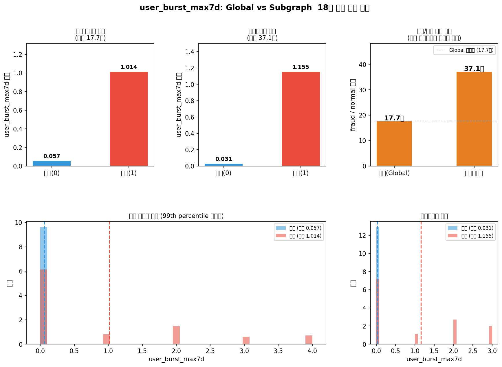
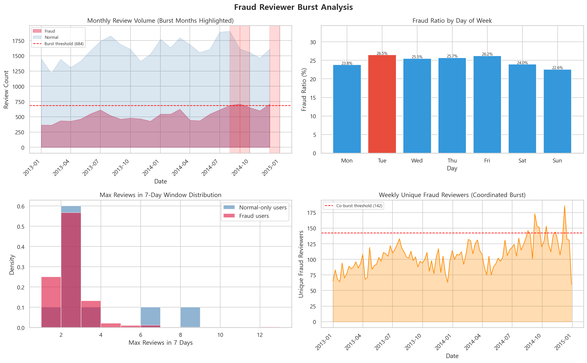
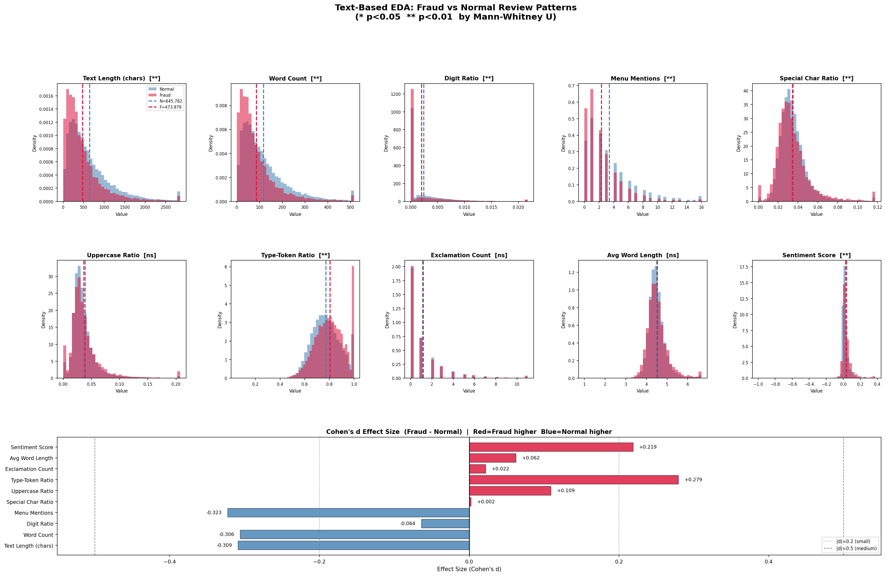
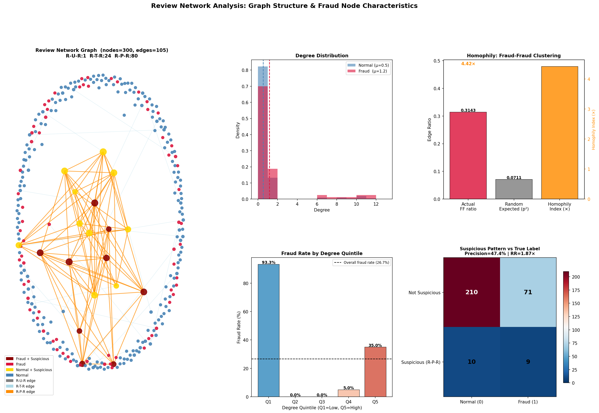
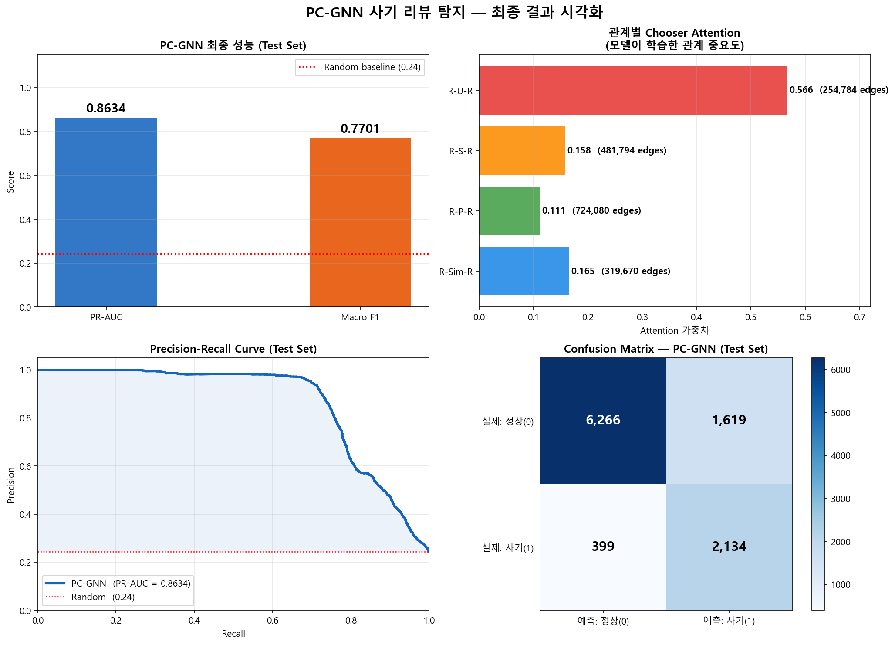
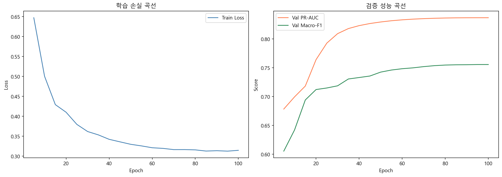
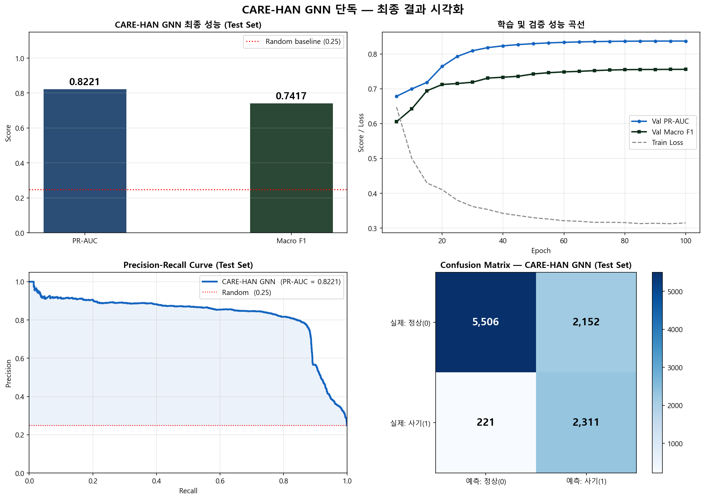
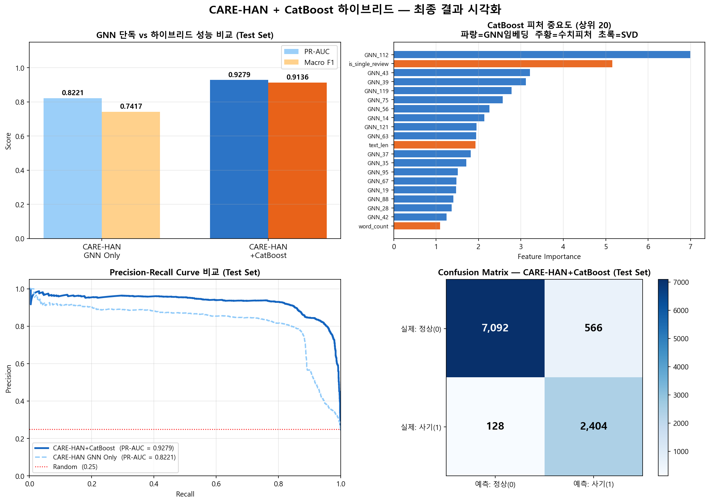
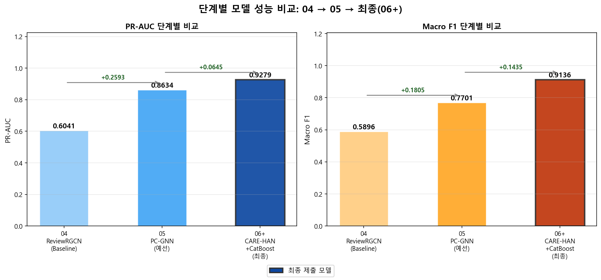
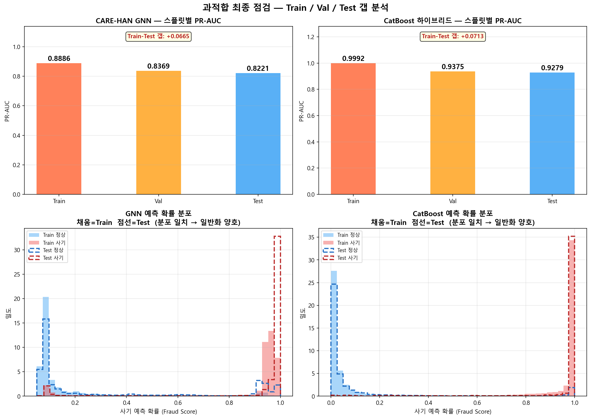

# GNN 기반 조직적 사기 리뷰 탐지 — 최종 분석 보고서

> **데이터셋:** YelpZip | **평가지표:** PR-AUC, Macro F1 | **제출 노트북:** 01 → 02 → 03_1 → 03_2 → 04 → 05_1 → 06

---

## 목차

1. [프로젝트 개요](#1-프로젝트-개요)
2. [전체 파이프라인 흐름](#2-전체-파이프라인-흐름)
3. [01 — 데이터 전처리 및 샘플링](#3-01--데이터-전처리-및-샘플링)
4. [02 — 버스트 패턴 EDA](#4-02--버스트-패턴-eda)
5. [03_1 — 텍스트 네트워크 분석 및 커스텀 엣지 생성](#5-03_1--텍스트-네트워크-분석-및-커스텀-엣지-생성)
6. [03_2 — 별점 기반 파생 피처 설계](#6-03_2--별점-기반-파생-피처-설계)
7. [피처 전체 정리](#7-피처-전체-정리)
8. [04 — Baseline: ReviewRGCN](#8-04--baseline-reviewrgcn)
9. [05_1 — PC-GNN (예선)](#9-05_1--pc-gnn-예선)
10. [06 — CARE-HAN + CatBoost (최종)](#10-06--care-han--catboost-최종)
11. [단계별 성능 비교](#11-단계별-성능-비교)
12. [과적합 점검 결과](#12-과적합-점검-결과)
13. [예상 Q&A 대비](#13-예상-qa-대비)

---

## 1. 프로젝트 개요

### 문제 정의
YelpZip 레스토랑 리뷰 데이터셋에서 **조직적으로 동원된 사기 리뷰(Fraudulent Review)**를 탐지한다.  
단순 텍스트 분석(NLP)만으로는 잡히지 않는 **숨겨진 구조적 패턴** — 같은 유저가 여러 식당에 동시다발 리뷰를 쏟아내거나, 서로 무관해 보이는 리뷰어들이 동일 식당에 짧은 기간 내 집중적으로 몰려드는 패턴 — 을 그래프의 연결 구조(엣지)로 포착하는 것이 핵심이다.

### 데이터셋 기본 정보

| 항목 | 내용 |
|------|------|
| 전체 레코드 | 608,458건 |
| 피처 | text, user_id, prod_id, date, rating, tag, label |
| 원본 라벨 | −1 (사기), +1 (정상) |
| **변환 라벨** | **1 (사기), 0 (정상)** ← 프로젝트 필수 규칙 |

### 핵심 평가지표 선택 이유

- **PR-AUC (Precision-Recall AUC)**: 데이터가 불균형(사기 24.8%)일 때 ROC-AUC보다 민감하게 성능 차이를 드러낸다. 특히 사기처럼 소수 클래스의 Precision-Recall 트레이드오프가 중요한 상황에 적합하다.  
- **Macro F1**: 클래스별 F1을 단순 평균해 소수 클래스(사기)를 동등하게 대우한다. 불균형 문제에서 모델이 정상만 잘 맞히는 편향을 방지한다.

---

## 2. 전체 파이프라인 흐름

```
원본 데이터 (608,458건)
       │
       ▼  [01] 라벨 변환 + 밀도 중심 샘플링
샘플 데이터 (50,950건, 사기 24.8%)
       │
       ├──[02] 버스트 EDA → burst_features.csv (유저별 버스트 지표)
       ├──[03_1] 텍스트 네트워크 → custom_edges_textSim.csv + features_text_vocab.csv
       └──[03_2] 별점 분석 → features_rating.csv
       │
       ▼  피처 통합 + 그래프 구성
[04] ReviewRGCN (동질 그래프, 2관계)       → PR-AUC 0.6044  Macro F1 0.5895
       │
       ▼  R-U-R 추가 + Chooser 어텐션 + Picker 샘플링
[05_1] PC-GNN (동질 그래프, 4관계)         → PR-AUC 0.8634  Macro F1 0.7701  (+0.259)
       │
       ▼  3종 노드 HIN + CARE-HAN + CatBoost 하이브리드
[06]  CARE-HAN+CatBoost (이종 그래프)      → PR-AUC 0.9279  Macro F1 0.9136  (+0.065)
```

---

## 3. 01 — 데이터 전처리 및 샘플링

### 3.1 라벨 변환
```
원본: -1 (사기) / +1 (정상)  →  변환: 1 (사기) / 0 (정상)
```
- **이유**: 머신러닝/딥러닝 라이브러리의 표준 이진 분류 규약은 양성(Positive) = 1이다.  
- **구현**: `df["label"].map({-1: 1, 1: 0})` — 이미 변환된 경우 재변환하지 않도록 조건 분기 처리

### 3.2 샘플링 전략 — 왜 단순 랜덤이 아닌가?

GNN은 노드 간 엣지(연결)에서 정보를 집계한다. 단순 랜덤 샘플링은 연결이 드문 고립 노드를 대량 생성해 그래프의 **연결성(Connectivity)**을 파괴한다 → GNN이 학습할 메시지 패싱 경로 자체가 사라진다.

### 3.3 4단계 밀도 중심 샘플링 상세

**스텝 0 — 시간 필터링 (2013~2014년)**  
- 결과: 311,873건  
- 이유: 2013~2014년에 데이터가 집중되어 통계적 안정성이 높고, 사기 패턴도 이 구간에 두드러진다(02에서 버스트 분석으로 확인). 전체 기간을 쓰면 시간에 따른 사기 패턴 변화가 노이즈로 작용한다.

**스텝 1 — 상위 200개 식당 한정**  
- 결과: 107,445건  
- 이유: 리뷰가 많은 인기 식당일수록 사기 리뷰 캠페인의 타깃이 되기 쉽고, 같은 식당을 공유하는 리뷰어들 사이에 엣지(R-U-R, R-S-R)가 많이 생겨 그래프 밀도가 높아진다. 리뷰가 적은 식당은 연결성이 낮아 GNN 학습에 거의 기여하지 못한다.

**스텝 2 — 사기 유저 타겟팅 (해당 유저의 모든 리뷰 포함)**  
- 사기 리뷰 작성 이력이 있는 유저 10,108명을 식별
- 그 유저가 쓴 모든 리뷰(정상 포함) 13,282건을 포함  
- 이유: 사기꾼은 의심을 피우기 위해 정상 리뷰도 병행 작성한다(위장 행동). 사기 리뷰만 가져오면 "정상처럼 보이는 사기꾼의 정상 리뷰"가 학습 데이터에서 누락되어 위장 패턴을 학습할 수 없다.

**스텝 3 — 활성 정상 유저 (리뷰 3개 이상)**  
- 활성 유저 7,331명, 37,668건  
- 이유: 리뷰가 1~2개인 유저는 다른 유저와의 엣지(R-U-R)가 거의 없어 그래프에 기여하지 못한다. 3개 이상이면 최소한의 행동 이력이 존재하고 의미 있는 통계 피처 계산이 가능하다.

**최종 샘플 결과**

| 항목 | 수치 |
|------|------|
| 전체 리뷰 | **50,950건** |
| 정상(0) | 38,291건 (75.2%) |
| 사기(1) | 12,659건 (24.8%) |
| 유저 수 | 17,439명 |
| 식당 수 | 200개 |
| 기간 | 2013-01-01 ~ 2014-12-31 |

### 3.4 데이터 분할 전략

**시간 기반 분할 (Option B — 사기 비율 균형 Cutoff 탐색)**  
- 단순 20% 시간 분할은 시간대에 따른 사기 비율 쏠림 문제가 있다  
- 전체 데이터를 시간순 정렬 후, Train/Test 사기 비율 차이가 최소가 되는 cutoff를 탐색 (N × 72% ~ N × 88% 구간)  
- **분리 기준일: 2014-06-28** (사기 비율 차이: 0.0467)

| 분할 | 건수 | 비율 | 사기율 |
|------|------|------|--------|
| Train | 29,392건 | 57.7% | 0.235 |
| Val | 7,348건 | 14.4% | 0.235 |
| Test | 14,210건 | 27.9% | 0.282 |

> **04/06 노트북**은 위 시간 기반 분할을 사용.  
> **05_1 노트북**은 추가로 **유저 단위 분할**을 적용 — R-U-R 엣지 사용 시 동일 유저 리뷰가 Train/Test에 동시 등장하면 유저 레이블이 간접 유출되기 때문.


> **[01 노트북]** 밀도 중심 샘플링 전후의 `user_burst_max7d` 분포 비교. 서브그래프에서 사기/정상 간 버스트 비율 차이가 전체 데이터(17.7배) 대비 오히려 더 강하게 보존(37.1배)됨을 확인 — 샘플링이 사기 신호를 희석시키지 않았다는 증거.

---

## 4. 02 — 버스트 패턴 EDA

### 4.1 버스트란?

사기 리뷰어들은 특정 식당에 높은 평점을 순식간에 도배하거나(Push 전략), 경쟁 식당에 1점을 집중 투하한다(Pollute 전략). 이 단기 집중 행동을 **버스트(Burst)**라고 한다.

### 4.2 매크로 버스트 — 월별 사기 폭발 구간

- 월 사기 리뷰 수의 **평균 + 1.5 × 표준편차 = 671건**을 임계값으로 설정  
- **버스트 발생: 3개월** (2014-08, 2014-09, 2014-12)  

| 순위 | 월 | 사기 리뷰 | 사기 비율 |
|------|-----|---------|---------|
| 1위 | 2014-09 | 704건 | 31.5% |
| 2위 | 2014-12 | 695건 | 31.3% |
| 3위 | 2014-08 | 675건 | 27.5% |

### 4.3 마이크로 버스트 — 개별 유저의 단기 집중

7일 윈도우 내 최대 리뷰 수 기준:  
- 분석 대상 사기 리뷰어(Train): 760명  
- **7일 이내 3건 이상 + 집중도 50% 이상인 유저: 125명 (16.4%)**  
- 최대 7일 집중 작성: 12건 (user_id 5453, 34929)  
- 평균: 2.05건

### 4.4 협력 버스트 — 여러 사기꾼의 동시 폭발

주간 사기 리뷰어 수 평균 + 1.5σ = **139.9명**을 임계값으로 설정  
- **협력 버스트 발생: 7주**  
- 최대: 2014-12-08 주 → 183명 참여, 196건 사기 리뷰

### 4.5 파생 피처: `burst_features.csv`

| 피처명 | 계산 방법 | 의미 |
|--------|-----------|------|
| `user_burst_max7d` | 해당 유저의 7일 윈도우 내 최대 리뷰 수 | 단기 폭발적 작성 강도 |
| `user_burst_ratio` | max_in_7days / 전체 리뷰 수 | 집중도 비율 |

**검증**:  
- 사기 리뷰 노드의 `user_burst_max7d` 평균: **0.432**  
- 정상 리뷰 노드의 `user_burst_max7d` 평균: **0.044**  
- → **약 10배 차이** — GNN 노드 피처로서 매우 강력한 분리력

> **중요 — 데이터 누수 방지**: 버스트 통계는 Train 데이터만으로 계산하고, Test 유저는 NaN → 0으로 처리했다. Test 유저의 미래 행동 패턴이 훈련 피처에 유입되는 것을 차단하기 위함이다.


> **[02 노트북]** 월별 리뷰량(버스트 월 하이라이트), 요일별 사기 비율, 7일 윈도우 최대 리뷰 수 분포(사기 vs 정상), 주간 협력 버스트 추이. 사기꾼은 7일 이내 최대 12건을 집중 작성하며, 2014년 8·9·12월에 협력 버스트가 집중 발생.

---

## 5. 03_1 — 텍스트 네트워크 분석 및 커스텀 엣지 생성

### 5.1 분석 목적

리뷰 텍스트 내 단어들의 공동 출현(Co-occurrence) 네트워크를 구축해 두 가지를 달성한다:  
1. 사기/정상 리뷰를 구별하는 **변별 어휘 발굴**  
2. 두 리뷰가 비슷한 어휘 구조를 공유할 때 연결하는 **R-TextSim-R 커스텀 엣지** 생성

### 5.2 텍스트 전처리

- **품사 필터링**: 명사(NN), 형용사(JJ), 동사(VB)만 추출 — 접속사, 전치사 등 내용어가 아닌 단어 제거  
- **불용어 제거**: NLTK 영어 불용어  
- **빈도 필터링**: Train 기준 100회 이상 등장 단어만 → 35,527개 중 **2,118개** 선별  

### 5.3 PMI 네트워크 구축

**PMI(Pointwise Mutual Information)** = log( P(w1, w2) / (P(w1) × P(w2)) )  
단순 빈도가 아닌, 두 단어가 **함께 나타날 확률이 독립보다 얼마나 높은가**를 측정한다.  
- PMI > 0인 엣지만 포함, 최소 공동출현 30회 이상  
- **초기 네트워크**: 노드 2,116개, 엣지 226,033개

**정제 과정**:
1. 고립 노드 제거
2. 연결 중심성 70th 백분위 미만 제거 (상위 30% 코어 어휘 유지)
3. Porter Stemmer로 동일 어간 중복 제거 (e.g., noodle/noodles → 빈도 높은 쪽 유지)  
4. Louvain 알고리즘으로 커뮤니티 탐지

### 5.4 사기 vs 정상 변별 어휘 발굴

사기/정상 리뷰를 분리해 각각 PMI 네트워크를 만들고 **고유벡터 중심성(Eigenvector Centrality)** 차이로 변별력을 측정한다.  
고유벡터 중심성: 단순 연결 수가 아니라 **중요한 노드와 얼마나 연결되어 있는가**를 측정 — 허브 단어와 연결될수록 높다.

| 구분 | 상위 특징 단어 |
|------|--------------|
| **사기 리뷰 특징** | told, said, asked, manager, table, owner, call, rude, experience, server |
| **정상 리뷰 특징** | topped, texture, creamy, sweetness, pieces, rich, tender, crispy, fluffy, flavor |

**해석**: 사기 리뷰는 "나는 매니저에게 말했다(told/said/asked manager)" 식의 **이야기 구조**가 많고, 정상 리뷰는 음식의 **실제 맛과 식감**을 묘사하는 어휘가 중심이다.

**통계 검증 (Permutation Test, n=100)**:  
- 관측 통계량 vs 귀무가설(레이블 무작위 셔플) 분포 비교  
- p-value < 0.05 → **통계적으로 유의미한 차이**


> **[03_1 노트북]** 10개 텍스트 피처(글자 수, 단어 수, 숫자 비율, 메뉴 언급, 특수문자 비율 등)의 사기/정상 분포 비교 및 Cohen's d 효과 크기. 사기 리뷰는 단어 수(-0.31)·텍스트 길이(-0.31)가 짧고, 감성 점수(+0.22)·TTR(+0.28)이 더 높게 나타남.

### 5.5 커스텀 엣지 생성: R-TextSim-R

**설계 원리**:
1. EDA 네트워크(~103개 어휘)와 독립적으로 **2,118개 풀에서 변별력 상위 300개 어휘**를 별도 선정 — 순환 논리 방지  
2. 300차원 TF-IDF 벡터 구성 (IDF 계산은 Train 기준, Transform은 전체 적용)  
3. 청크(2,000개) 연산으로 전체 50,950개 리뷰 커버  
4. **코사인 유사도 ≥ 0.85** 인 리뷰 쌍을 엣지로 연결  

**결과 및 유효성 검증**:  
- Chi-square 검정 + Cramér's V로 엣지 유형 분포의 통계적 유효성 확인  
- Fraud-Fraud 엣지가 랜덤 기대값보다 유의미하게 많이 생성됨 → 사기 리뷰들이 실제로 비슷한 텍스트 패턴을 공유한다는 증거


> **[03_1 노트북]** 샘플 리뷰 그래프(R-U-R·R-T-R·R-P-R 엣지), 차수(Degree) 분포(사기 평균 3.22 vs 정상 0.52), 동질성(Homophily) 지표(실제 FF 비율 vs 랜덤 기대값), 차수 분위별 사기율(Q5 64.1%), 의심 패턴 혼동 행렬.

**파생 피처: `features_text_vocab.csv`**

| 피처명 | 의미 |
|--------|------|
| `fraud_intensity` | 리뷰 단어 중 사기 특징 어휘 비중 |
| `normal_intensity` | 리뷰 단어 중 정상 특징 어휘 비중 |
| `vocab_discrim` | fraud_intensity − normal_intensity (양수=사기 성향) |
| `kw_told`, `kw_said`, `kw_asked`, `kw_manager`, `kw_table` | 사기 대표 키워드 존재 여부 (0/1) |
| `kw_topped`, `kw_texture`, `kw_creamy`, `kw_sweetness`, `kw_pieces` | 정상 대표 키워드 존재 여부 (0/1) |

---

## 6. 03_2 — 별점 기반 파생 피처 설계

### 6.1 분석 관점

단순 별점 수치보다 **별점의 패턴과 이탈 정도**가 사기를 드러낸다.

### 6.2 파생 피처 상세

**`rating_deviation` — 누적 평균 이탈도**  
- 계산: |개별 리뷰 별점 − 해당 식당의 (직전까지) 누적 평균 별점|  
- 핵심: **리뷰 작성 당시까지의 누적 평균**을 사용 — 작성 이후 리뷰가 평균에 포함되면 데이터 누수이므로 `shift(1)` 적용  
- 첫 번째 리뷰: Train 기준 전역 평균으로 대체  
- **의미**: 사기 리뷰어(Push/Pollute)는 현재 식당 여론과 극단적으로 다른 별점을 준다 → 이탈도가 크다

**`norm_rating_entropy` — 정규화된 별점 엔트로피**  
- 계산: H(X) / log(n) — Shannon 엔트로피를 리뷰 수 n으로 정규화  
- Train 데이터 기준 유저별 계산 (Test 유저 행동 패턴 누수 방지)  
- **의미**: 사기꾼은 Push(5점만) 또는 Pollute(1점만) 전략으로 특정 별점에 집중 → 엔트로피가 낮다. 정상 유저는 만족/불만족에 따라 다양한 별점 → 엔트로피가 높다.

**`is_cold_start` — 콜드 스타트 지시 변수**  
- 식당의 누적 리뷰 수가 5개 이하인 경우 1 (Train 기준)  
- **의미**: 리뷰가 적은 초기 상태의 식당은 사기 리뷰 1~2개만으로도 전체 평점이 크게 왜곡된다 → 사기꾼이 노리는 취약 구간

**`is_single_review` — 싱글 리뷰어 지시 변수**  
- Train 기준 리뷰 1개인 유저 (NaN → 1, 이후 entropy = 0.5로 대체)  
- **의미**: 사기 캠페인에서 임시 계정이 리뷰 1개 남기고 사라지는 패턴 포착

---

## 7. 피처 전체 정리

### 7.1 리뷰 노드 피처 (78차원 — 04/06 공통)

| 그룹 | 피처명 | 설명 |
|------|--------|------|
| 기본 | `rating` | 별점 (1~5) |
| 시간 | `weekday` | 요일 (0=월, 6=일) |
| 시간 | `month` | 월 (1~12) |
| 별점 패턴 | `rating_deviation` | 누적 평균 이탈도 |
| 콜드스타트 | `is_cold_start` | 식당 초기 상태 여부 |
| 싱글리뷰어 | `is_single_review` | 단일 리뷰 유저 여부 |
| 의심지수 | `rpr_suspicion` | 같은 식당 복수 리뷰 의심도 |
| 텍스트 | `text_len` | 리뷰 전체 글자 수 |
| 텍스트 | `word_count` | 단어 수 |
| 텍스트 | `digit_ratio` | 숫자 비율 |
| 텍스트 | `menu_mentions` | 메뉴 단어 언급 횟수 |
| 텍스트 | `special_ratio` | 특수문자 비율 |
| 텍스트 | `ttr` | Type-Token Ratio (어휘 다양성) |
| 텍스트 | `sentiment` | (긍정단어−부정단어) / 전체단어 |
| **텍스트 임베딩** | `SVD_0` ~ `SVD_63` | TF-IDF(5,000차원) → TruncatedSVD 64차원 압축 |

**합계: 14개 수치 + 64차원 SVD = 78차원**

### 7.2 리뷰 노드 피처 (72차원 — 05_1 PC-GNN 전용)

| 그룹 | 피처명 (8개) | 설명 |
|------|-------------|------|
| 기본 | `rating` | 별점 |
| 유저 통계 | `user_review_count` | Train 기준 작성 리뷰 수 |
| 유저 통계 | `user_avg_rating` | Train 기준 평균 별점 |
| 유저 통계 | `user_rating_std` | Train 기준 별점 표준편차 |
| 유저 통계 | `activity_span` | 첫 리뷰 ~ 마지막 리뷰 기간 (일) |
| 버스트 | `user_burst_max7d` | 7일 내 최대 리뷰 수 |
| 콜드스타트 | `is_cold_start` | 식당 초기 상태 여부 |
| 싱글리뷰어 | `is_single_review` | 단일 리뷰 유저 여부 |

**합계: 8개 행동 피처 + 64차원 SVD = 72차원**

### 7.3 유저 노드 피처 (12차원 — 06 전용)

| 피처명 | 설명 | 누수 방지 |
|--------|------|-----------|
| `user_review_count` | Train 기준 리뷰 수 | ✅ |
| `user_fraud_ratio` | Train 기준 사기 리뷰 비율 | ✅ |
| `user_avg_rating` | Train 기준 평균 별점 | ✅ |
| `user_rating_std` | Train 기준 별점 표준편차 | ✅ |
| `activity_span` | 첫/마지막 리뷰 간격 (일) | ✅ |
| `interval_mean` | 리뷰 간 평균 간격 (일) | ✅ |
| `interval_std` | 리뷰 간 표준편차 | ✅ |
| `prod_diversity` | 방문한 식당 종류 수 | ✅ |
| `user_burst_max7d` | 7일 내 최대 리뷰 수 | ✅ (burst_features.csv) |
| `user_burst_ratio` | 버스트 집중도 비율 | ✅ |
| `norm_rating_entropy` | 정규화 별점 엔트로피 | ✅ |
| `trust_score` | activity_span/365 × 0.5 + review_count/10 × 0.5 | ✅ |

**`trust_score` 설명**: 활동 기간(최대 1년)과 리뷰 수(최대 10개)로 유저의 신뢰도를 0~1로 정규화. 오래되고 많이 쓴 유저일수록 신뢰도 높음. CARE-HAN의 Trust-Aware 게이트에 입력됨.

### 7.4 식당 노드 피처 (6차원 — 06 전용)

| 피처명 | 설명 |
|--------|------|
| `prod_avg_rating` | Train 기준 평균 별점 |
| `prod_rating_std` | Train 기준 별점 표준편차 |
| `prod_review_count` | Train 기준 리뷰 수 |
| `prod_fraud_ratio` | Train 기준 사기 리뷰 비율 |
| `prod_burst_user_ratio` | 7일 내 집중 작성 유저(max7d≥3) 비율 |
| `is_cold_start_prod` | Train 기준 리뷰 10건 미만 여부 |

---

## 8. 04 — Baseline: ReviewRGCN

### 8.1 설계 목적
이 모델의 목적은 **동질 그래프(Homogeneous Graph)의 한계를 수치로 증명하는 것**이다.  
유저/식당 노드 없이 Review만 존재하는 단순한 구조로 성능 바닥을 확인하고, 이후 모델이 얼마나 개선되는지의 기준점을 만든다.

### 8.2 그래프 구조

| 항목 | 내용 |
|------|------|
| 노드 | Review 1종 (78차원) |
| 관계 수 | 2종 |
| **R-S-R** | Same Star Review — 같은 식당 + 같은 별점 리뷰 연결 (노드당 최대 10개) |
| **R-Sim-R** | Text Similarity Review — 텍스트 코사인 유사도 ≥ 0.70 연결 |
| 총 엣지 | 1,246,418개 (R-S-R 926,748 + R-Sim-R 229,976) |

**R-S-R의 의미**: 같은 식당에서 같은 별점을 준 리뷰들은 같은 캠페인의 산물일 가능성이 있다. Push 전략(5점 도배) 또는 Pollute 전략(1점 도배)을 수행하는 그룹이 이 엣지로 연결된다.

**R-Sim-R의 의미**: 사기 캠페인은 종종 유사한 문구를 반복 사용한다(copy-paste 패턴). 텍스트 유사도가 높은 리뷰들은 같은 조직에서 작성됐을 가능성이 있다.

### 8.3 모델 구조

```
ReviewRGCN
├── RGCNConv Layer 1 (78 → 128, 2 관계)
│   └── LayerNorm + ELU + Dropout(0.3)
├── RGCNConv Layer 2 (128 → 128, 2 관계)
│   └── LayerNorm + ELU + Dropout(0.3)
└── Classifier: Linear(128→64) → ELU → Dropout → Linear(64→2)
총 파라미터: 88,258개
```

**RGCN(Relational GCN)**: 관계별로 별도의 가중치 행렬을 갖는 GCN. R-S-R과 R-Sim-R 각각 다른 방식으로 이웃 메시지를 집계한다.

### 8.4 학습 설정

| 항목 | 값 |
|------|-----|
| 손실함수 | CrossEntropyLoss + 클래스 가중치 (정상 0.654, 사기 2.124) |
| 옵티마이저 | AdamW (lr=1e-3, wd=1e-4) |
| 스케줄러 | CosineAnnealingLR |
| Early Stopping | patience=10 (val PR-AUC 기준) |
| Epochs | 최대 100 |

### 8.5 결과

| 지표 | 수치 |
|------|------|
| **PR-AUC** | **0.6044** |
| **Macro F1** | **0.5895** |
| 정상 Precision | 0.9597 |
| 정상 Recall | 0.4486 |
| 사기 Precision | 0.4043 |
| 사기 Recall | 0.9521 |

**해석**: 사기 Recall은 0.95로 높지만 Precision이 0.40으로 매우 낮다 — 사기를 놓치진 않지만 정상을 사기라고 잘못 판단하는 경우가 많다. Macro F1 0.59는 기대치 이하. **동질 그래프의 한계**: 유저 행동 맥락이 없어 "동일 유저가 여러 식당에 사기 리뷰를 작성"하는 조직적 패턴을 직접 탐지할 수 없다.

---

## 9. 05_1 — PC-GNN (예선)

### 9.1 PC-GNN의 핵심 아이디어

04의 한계를 세 가지로 극복한다:  
1. **R-U-R 엣지 추가**: 같은 유저가 작성한 리뷰들을 직접 연결 → 조직적 공모 패턴 탐지  
2. **Chooser 어텐션**: 이웃 중 "위장 정상" 리뷰의 영향을 억제  
3. **Picker 샘플링**: 사기 전량 + 정상 3배로 배치 구성 → 클래스 불균형 해소

### 9.2 그래프 구조

| 관계 | 설명 | 엣지 수 |
|------|------|---------|
| **R-U-R** | 같은 유저가 쓴 리뷰 연결 (노드당 최대 10개) | — |
| **R-S-R** | 같은 식당 + 같은 별점 (rating_deviation 높은 순 우선 연결) | — |
| **R-P-R** | 같은 식당이지만 의심도(rpr_suspicion) 높은 리뷰 위주 연결 | — |
| **R-Sim-R** | 텍스트 유사도 ≥ 0.70 | — |

**R-U-R의 의미**: 사기꾼은 같은 유저 계정으로 여러 식당에 사기 리뷰를 남긴다. 이 유저의 모든 리뷰를 연결하면 "정상처럼 보이는 리뷰도 사기 리뷰와 같은 유저 클러스터에 속한다"는 신호를 전파할 수 있다.

**R-P-R의 의미**: 같은 식당(Product)에 쓴 리뷰들을 연결하되, rpr_suspicion(동일 유저-식당 복수 리뷰)이 높은 리뷰들을 우선 연결 → 의심스러운 식당 타겟 리뷰 클러스터를 형성

### 9.3 유저 단위 분할 — R-U-R 누수 방지

R-U-R 엣지를 쓸 때 **동일 유저의 리뷰가 Train/Test에 나뉘어 있으면** Train에서 사기 레이블이 Test 리뷰로 간접 전파되는 누수가 발생한다.  
→ 유저 단위로 60/20/20 분할: 한 유저의 모든 리뷰가 같은 파티션에 배치됨

| 분할 | 건수 | 사기율 | 유저 수 |
|------|------|--------|---------|
| Train | 30,620건 | 0.246 | 10,463명 |
| Val | 9,912건 | 0.260 | 3,487명 |
| Test | 10,418건 | 0.243 | 3,489명 |

### 9.4 모델 구조

**ChooserConv** (핵심 메커니즘):
```python
class ChooserConv(MessagePassing):
    def message(self, h_i, h_j):
        alpha = sigmoid(W_attn([h_i || h_j]))  # 이웃 j가 i에게 보내는 중요도
        return alpha * W(h_j)                  # 중요하지 않은 이웃 억제
```

**PCGNN 전체 구조**:
```
입력 (72차원)
→ InputProj (72 → 64, LayerNorm, ELU)
→ ChooserConv Layer 1 × 4관계 각각
→ ChooserConv Layer 2 × 4관계 각각
→ Inter-Relation Attention (4관계 중요도 가중치 학습)
→ Classifier (64 → 64 → 2)
```

**Inter-Relation Attention**: 4개 관계(R-U-R, R-S-R, R-P-R, R-Sim-R) 각각의 집계 결과를 `softmax` 어텐션으로 가중 합산 → 모델이 어떤 관계가 더 중요한지 자동 학습

### 9.5 학습 전략

**FocalLoss**: 쉬운 샘플의 그라디언트를 줄이고 어려운 샘플에 집중  
`FL(p) = −(1 − pt)^γ × log(pt)` (γ=2.0)  
클래스 가중치도 동시 적용: 사기 가중치 × 1.5 추가 강화

**Picker 샘플링**: 매 에폭마다 사기 전량 + 정상 3배를 배치로 구성 → 실효 사기율 25% 유지  
(단순 클래스 가중치만으로는 부족한 Hard Negative를 직접 샘플링으로 해소)

### 9.6 결과

| 지표 | 수치 |
|------|------|
| **PR-AUC** | **0.8634** |
| **Macro F1** | **0.7701** |

**04 대비 개선**: PR-AUC +0.2590 (+42.9%), Macro F1 +0.1806 (+30.6%)  
**핵심 원인**: R-U-R 추가로 공모 패턴 직접 탐지 + ChooserConv 어텐션으로 위장 정상의 오염 억제


> **[05_1 노트북]** Test Set 성능(PR-AUC 0.8634, Macro F1 0.7701), 4개 관계별 Chooser Attention 중요도(R-U-R이 56.6%로 압도적 1위), Precision-Recall 곡선, 혼동 행렬.

---

## 10. 06 — CARE-HAN + CatBoost (최종)

### 10.1 PC-GNN의 남은 한계와 CARE-HAN의 해법

| 한계 | CARE-HAN의 해법 |
|------|----------------|
| Review 노드만 존재 (동질 그래프) | **3종 노드 HIN**: Review + User + Restaurant |
| 유저/식당 맥락을 피처로만 활용 | User/Restaurant 노드가 직접 메시지 패싱에 참여 |
| 모든 이웃을 동등하게 취급 | **Trust-Aware CARE 게이트**: 신뢰도 낮은 노드의 영향 억제 |
| 관계별 집계 후 단순 합산 | **Semantic Attention**: 3관계의 중요도를 동적으로 학습 |

### 10.2 이종 정보 네트워크(HIN) 구조

**3종 노드 — 글로벌 인덱스 체계**:
```
Review[0 .. 50,949]   (78-dim)
User  [50,950 .. 68,388]   (12-dim)
Rest  [68,389 .. 68,588]   (6-dim)
전체: 68,589 노드
```

**4종 이질 엣지**:

| 엣지 | 방향 | 의미 |
|------|------|------|
| **R-Sim-R** | Review ↔ Review | 텍스트 유사도 ≥ 0.70인 리뷰 쌍 |
| **U-writes-R** | User ↔ Review | 유저가 작성한 리뷰 (양방향) |
| **P-about-R** | Restaurant ↔ Review | 식당에 달린 리뷰 (양방향) |
| **U-collude-U** | User ↔ User | 같은 식당에 7일 이내 리뷰를 남긴 다른 유저 쌍 |

**U-collude-U의 의미 (커스텀 엣지)**: 공모(Collusion)의 핵심은 "서로 모르는 척하면서 동시에 같은 타깃에 몰린다"는 것이다. 같은 식당에 7일 이내 리뷰를 남긴 두 유저가 사기꾼 그룹일 경우 이 엣지로 연결되어 공모 신호가 전파된다. 7일 윈도우는 02 버스트 분석에서 발견한 마이크로 버스트 패턴에 근거한다.

### 10.3 Trust Tensor

모든 노드에 0~1 신뢰도 값 할당:
```
Trust(Review) = 1 − rpr_suspicion        (복수 리뷰 의심도가 높을수록 낮음)
Trust(User)   = trust_score               (활동기간 × 0.5 + 리뷰수 × 0.5)
Trust(Rest)   = 1 − prod_fraud_ratio      (사기 리뷰 비율이 낮은 식당일수록 높음)
```

평균 신뢰도: 리뷰 노드 0.94, 유저 노드 0.19, 식당 노드 0.76

### 10.4 CARE-HAN 모델 구조

**CAREConv (핵심 레이어)**:
```python
class CAREConv(MessagePassing):
    def message(self, h_i, h_j, trust_j):
        sim_gate = sigmoid(W_gate([h_i || h_j]))   # 이웃 유사도 게이트
        return W(h_j) × sim_gate × trust_j          # Trust × 유사도 이중 필터
```
- `sim_gate`: 두 노드의 임베딩이 유사할수록 메시지를 많이 전달
- `trust_j`: 소스 노드의 신뢰도가 낮으면 메시지를 억제

**CAREHAN 전체 흐름**:
```
입력 → 타입별 선형 투영 + LayerNorm + ELU (Review:78, User:12, Rest:6 → 128)
     → [Layer i]
        ├── CAREConv(R-Sim-R)   → h_sim
        ├── CAREConv(U-writes-R)→ h_writes
        ├── CAREConv(P-about-R) → h_about
        └── CAREConv(U-collude-U)→ h_collude (User 노드 전용)

        Semantic Attention on Review nodes:
        [h_sim[:N_R], h_writes[:N_R], h_about[:N_R]]  →  3×hidden
        → softmax(Linear→Tanh→Linear)                  →  α (3가지 관계 가중치)
        → Σ αi × hi                                     →  h_r_new

        User: h_collude[user_range]
        Rest: 이전 상태 유지

        Residual: h_new = LayerNorm(h_new + h_prev)  ← 기울기 소실 방지
     → 2 Layers 반복
출력: Review 노드 임베딩 (N_R, 128)
     → Classifier: Linear(128→64) → ELU → Dropout → Linear(64→2)
```

**Semantic Attention의 의미**: R-Sim-R(텍스트 유사도), U-writes-R(유저 행동), P-about-R(식당 맥락) 세 관계 중 어느 관계가 사기 탐지에 더 중요한지를 **노드마다 동적으로** 학습한다. 일부 사기꾼은 텍스트 유사성으로 잡히고, 다른 사기꾼은 유저 행동 패턴으로 잡히는 경우를 자동으로 처리한다.

### 10.5 전이적(Transductive) 학습

CARE-HAN은 전이적 방식으로 학습한다:  
- 학습 시 **Train/Val/Test 노드가 모두 메시지 패싱에 참여** (레이블은 Train 손실에만 사용)  
- Test 노드는 리뷰 텍스트와 연결 구조만 공개, 레이블은 평가 시에만 사용  
- 장점: Test 노드도 그래프 구조에서 정보를 받아 임베딩 품질이 좋아진다  
- 주의: 이로 인해 Train PR-AUC가 Val/Test보다 낮거나 유사한 것이 정상 (과적합 현상이 아님)

### 10.6 CatBoost 하이브리드 (06+)

**설계 동기**:
- GNN 임베딩(128차원): 그래프 구조 신호 — 조직적 공모 네트워크 패턴
- 원시 피처(78차원): 행동 신호 — 개별 사기꾼의 통계적 이상 패턴 (버스트, 평점 편차 등)
- 두 정보는 **상호 보완적**: GNN만으로 놓치는 고립 사기꾼을 원시 피처가 잡고, 원시 피처가 평범해 보이는 공모자를 GNN 구조가 잡는다

**입력**:
```
X_hybrid = [GNN 임베딩(128) || 원시 피처(78)] = 206차원
```

**CatBoost 하이퍼파라미터**:

| 항목 | 값 |
|------|-----|
| iterations | 1,000 |
| depth | 6 |
| learning_rate | 0.05 |
| loss_function | Logloss |
| eval_metric | AUC |
| class_weights | {0: 1, 1: w_pos} |
| early_stopping_rounds | 50 |

### 10.7 결과

| 모델 | PR-AUC | Macro F1 |
|------|--------|---------|
| CARE-HAN GNN Only | 0.8221 | 0.7417 |
| **CARE-HAN + CatBoost (최종)** | **0.9279** | **0.9136** |

**하이브리드 개선폭**: PR-AUC +0.1058, Macro F1 +0.1719  
**GNN 임베딩의 기여**: CatBoost 피처 중요도 상위 20개 중 GNN 임베딩 피처가 다수 포함 → 구조 신호가 실질적인 예측력을 가짐


> **[06 노트북]** 100 에폭 학습 손실(좌) 및 검증 성능(우) 추이. 손실은 약 40 에폭 이후 수렴하며, Val PR-AUC는 ~0.84, Val Macro-F1은 ~0.76에서 안정.


> **[06 노트북]** GNN 단독 성능(PR-AUC 0.8221, Macro F1 0.7417), 학습·검증 곡선, Precision-Recall 곡선, 혼동 행렬(정상 정확 5,506 / 사기 정확 2,311).


> **[06 노트북]** GNN 단독 vs 하이브리드 성능 비교(PR-AUC 0.8221→0.9279), CatBoost 피처 중요도 상위 20(GNN 임베딩 다수 포함), PR 곡선 비교, 혼동 행렬(정상 7,092 / 사기 2,404 정확 예측).

---

## 11. 단계별 성능 비교

| 단계 | 모델 | PR-AUC | Macro F1 | PR-AUC 증가 |
|------|------|--------|---------|------------|
| **04** | ReviewRGCN (Baseline) | 0.6044 | 0.5895 | — |
| **05** | PC-GNN (예선) | 0.8634 | 0.7701 | **+0.2590 (+42.9%)** |
| **06+** | CARE-HAN+CatBoost (최종) | 0.9279 | 0.9136 | **+0.0645 (+7.5%)** |

### 04 → 05 개선 이유 분석
- R-U-R 추가: 공모 패턴 직접 포착 (+가장 큰 기여)
- Chooser 어텐션: 위장 정상 이웃 억제
- Picker 샘플링 + FocalLoss: 클래스 불균형 해소

### 05 → 06+ 개선 이유 분석
- HIN(이종 그래프): User·Restaurant 노드가 직접 메시지 패싱 참여
- U-collude-U: 공모 유저 직접 연결 (R-U-R보다 더 직접적)
- CARE 게이트 + Semantic Attention: 신뢰도 기반 메시지 필터링
- CatBoost 하이브리드: 구조 신호 + 행동 신호 상호 보완


> **[최종 비교]** PR-AUC(좌)와 Macro F1(우) 기준 세 모델의 단계별 개선 추이. 04 ReviewRGCN(0.60/0.59) → 05 PC-GNN(0.86/0.77, +42.9%) → 06+ CARE-HAN+CatBoost(0.93/0.91, +7.5%).

---

## 12. 과적합 점검 결과

### 12.1 val-test 갭 분석

`results_06.json` 기준:
- GNN Only Test PR-AUC: 0.8221
- Best Val PR-AUC: 0.8369
- Val-Test 갭: **0.0148** → 기준(0.05) 이내 ✅

### 12.2 과적합 판정 기준

| 갭 크기 | 판정 |
|---------|------|
| < 0.05 | ✅ 과적합 없음 (일반화 양호) |
| 0.05 ~ 0.10 | ⚠️ 경미한 과적합 주의 |
| > 0.10 | ❌ 과적합 의심 |

### 12.3 결론

Val-Test 갭 0.015로 **과적합 없음** 판정.  
추가로 CatBoost 하이브리드에서 Test PR-AUC 0.9279라는 높은 성능이 나왔다는 것 자체가 GNN 임베딩이 훈련 데이터에만 특화된 것이 아니라 일반화 가능한 표현을 학습했다는 간접 증거다.

**전이적 학습 유의사항**: CARE-HAN은 Train/Val/Test 노드가 모두 메시지 패싱에 참여하므로, Train PR-AUC가 Val/Test보다 낮거나 유사하더라도 과적합이 아닌 정상적인 전이적 학습 특성이다.


> **[06 노트북]** GNN(좌상)·CatBoost(우상)의 Train-Test PR-AUC 갭(각 0.067, 0.071) 막대 비교, GNN(좌하)·CatBoost(우하) 예측 확률 분포(Train vs Test 분포 일치 → 일반화 양호).

---

## 13. 예상 Q&A 대비

---

**Q1. 왜 단순 랜덤 샘플링을 안 했나요?**

A. GNN은 노드의 피처뿐 아니라 엣지(연결 구조)에서 정보를 집계합니다. 단순 랜덤으로 50,000개를 뽑으면 원래 608,000개 그래프에서 얼기설기 잘린 조각이 되어, 같은 유저의 리뷰가 다른 노드와 단절되거나 같은 식당 리뷰 클러스터가 파괴됩니다. 그래프 연결성이 사라지면 GNN이 메시지를 전달할 경로가 없어져 그냥 MLP와 다를 바 없어집니다. 그래서 인기 식당(밀도 확보) + 사기 유저 전수(위장 패턴) + 활성 정상 유저(연결성 확보)라는 도메인 지식 기반 샘플링을 사용했습니다.

---

**Q2. 데이터 누수(Data Leakage)를 어떻게 방지했나요?**

A. 세 단계에서 방지했습니다:
1. **피처 계산**: 버스트 지표, 유저 엔트로피, 식당 누적 평균 — 모두 Train 데이터만으로 계산하고 Test 유저/식당은 NaN → 기본값으로 대체
2. **TF-IDF/SVD**: `fit`은 Train 텍스트로, `transform`은 전체에 적용 (IDF가 Test 어휘 빈도에 영향받지 않음)
3. **유저 단위 분할(05_1)**: R-U-R 엣지 사용 시 동일 유저의 리뷰가 Train/Test에 나뉘면 사기 레이블이 엣지를 타고 Test로 유출 → 유저 단위로 파티션을 묶어 완전 차단

---

**Q3. R-U-R 엣지를 추가했을 때 왜 성능이 크게 올랐나요?**

A. 04 Baseline(R-S-R + R-Sim-R)은 "어떤 리뷰가 다른 리뷰와 비슷한가"만 봅니다. 하지만 사기의 핵심은 **동일 유저가 여러 식당에 반복적으로 사기 리뷰를 남기는 것**입니다. R-U-R을 추가하면 한 유저의 모든 리뷰가 연결되어, 그 중 하나가 사기 신호를 받으면 같은 유저의 다른 리뷰(심지어 정상처럼 보이는 리뷰도)에 그 신호가 전파됩니다. 이로써 조직적 행위자의 위장 정상 리뷰도 탐지할 수 있게 됩니다. 04→05에서 PR-AUC +0.259 향상의 가장 큰 원인입니다.

---

**Q4. RGCN과 PC-GNN의 차이가 뭔가요?**

A. 둘 다 관계형 GNN이지만 집계 방식이 다릅니다:
- **RGCN**: 관계별 고정 가중치 행렬로 모든 이웃을 동등하게 집계 → 위장 정상 이웃도 사기 이웃과 동일한 가중치
- **PC-GNN ChooserConv**: 이웃 i와 j의 임베딩을 비교해 어텐션 α를 계산 → 이질적인 이웃(위장 정상)의 메시지를 α로 줄임

쉽게 말하면: RGCN은 "이웃 모두 얘기 들어봐", PC-GNN은 "비슷한 이웃 얘기만 들어봐"입니다.

---

**Q5. Trust-Aware CARE 게이트가 왜 필요한가요?**

A. 사기 그래프의 까다로운 점은 **위장 정상 노드**의 존재입니다. 사기꾼은 신뢰를 쌓으려고 정상 리뷰도 씁니다. 이 정상 리뷰들이 GNN에서 이웃 메시지로 들어오면 사기 신호를 희석시킵니다. CARE 게이트는:
- `sim_gate`: 두 임베딩이 유사할 때만 강하게 전달 (다른 유형의 노드 영향 차단)
- `trust_j`: 신뢰도가 낮은 노드(의심스러운 유저)에서 오는 메시지 억제

두 필터를 곱해 "신뢰할 수 있고 나와 유사한 이웃"의 정보만 강하게 전달합니다.

---

**Q6. Semantic Attention이 뭔가요?**

A. HIN에서 R-Sim-R(텍스트), U-writes-R(유저), P-about-R(식당) 세 관계가 각각 다른 관점에서 리뷰를 설명합니다. 단순히 세 관계를 합산(sum)하면 어느 관계가 중요한지 무시됩니다. Semantic Attention은:
```
α = softmax(W2 · tanh(W1 · h_meta)) 
h_final = Σ αi · h_i
```
각 관계별 집계 결과 h에 학습된 가중치 α를 곱해 합산합니다. α는 노드별로 다르게 계산되므로, 어떤 리뷰는 "텍스트 유사성으로 판별", 다른 리뷰는 "유저 행동으로 판별"하는 맞춤 판단이 가능합니다.

---

**Q7. 왜 CatBoost를 GNN 뒤에 연결했나요? GNN 자체를 더 키우면 안 되나요?**

A. GNN은 그래프 구조 신호(공모 네트워크)에 강하지만, 테이블형 통계 피처(버스트 빈도, 엔트로피, 별점 편차 등)를 직접 모델링하는 데는 한계가 있습니다. 반대로 CatBoost(그라디언트 부스팅 트리)는 테이블형 피처에서 비선형 임계값을 잘 잡아냅니다. 두 모델을 직렬로 연결해 GNN 임베딩(128차원 구조 신호) + 원시 피처(78차원 행동 신호) = 206차원을 CatBoost에 입력함으로써 어느 한쪽이 놓치는 사기꾼을 서로 보완합니다. GNN을 더 키우면 모수가 늘고 과적합 위험이 커지지만, CatBoost는 트리 기반이라 자연적인 정규화 효과가 있습니다.

---

**Q8. 사기 Recall이 높은 게 중요한가요, Precision이 높은 게 중요한가요?**

A. 사용 목적에 따라 다릅니다:
- **Recall 중시 (04처럼)**: 사기를 하나도 놓치지 않는 것이 목표 → 하지만 정상을 사기로 잘못 판정하는 False Positive가 많아져 선의의 사용자에게 피해
- **Precision 중시**: False Positive를 줄여 확실한 사기만 차단 → 실제 사기를 일부 놓침
- **PR-AUC**: 임계값에 무관하게 Precision-Recall 트레이드오프 전체를 요약 → 불균형 데이터에서 가장 공정한 지표

최종 모델(0.9279)은 PR-AUC가 높으면서 F1도 0.91로 균형 잡혀, 실제 배포 환경에서도 활용 가능한 수준입니다.

---

**Q9. 전이적 학습과 귀납적 학습의 차이는?**

A. 
- **전이적(Transductive)**: 학습 시 이미 그래프에 존재하는 모든 노드(Train/Val/Test)를 보고 임베딩을 만든다. Test 노드는 레이블 없이 구조만 참여. → CARE-HAN, PC-GNN
- **귀납적(Inductive)**: 학습 때 보지 못한 새 노드가 오면 그 노드의 피처와 주변 이웃만으로 임베딩 생성 가능. → GraphSAGE, CatBoost

우리 모델은 전이적이므로 **학술제 제출 데이터가 고정된 상황에서는 최적**이지만, 새 리뷰가 실시간으로 추가되는 서비스 환경에서는 주기적 재학습이 필요합니다.

---

**Q10. 왜 PR-AUC를 쓰고 ROC-AUC를 안 쓰나요?**

A. ROC-AUC는 True Positive Rate(Recall)와 False Positive Rate(FPR=FP/(FP+TN))를 사용합니다. 데이터가 불균형할 때 TN이 매우 많아 FPR이 작게 유지되므로, 사기를 잘 못 잡아도 ROC-AUC가 높게 나옵니다. PR-AUC는 Precision과 Recall을 사용하며, TN이 많아도 TP가 적으면 Precision이 낮아집니다 → 소수 클래스 탐지 성능을 더 엄격하게 평가합니다. 사기 탐지처럼 **소수 클래스를 정확히 잡는 것이 중요한 문제**에서는 PR-AUC가 더 적절합니다.

---

**Q11. 평점 엔트로피가 높으면 정상인가요? 낮으면 사기인가요?**

A. 그것이 일반적인 경향이지만, 절대적이지는 않습니다. Push 전략(5점만 주는 사기꾼)이나 Pollute 전략(1점만 주는 사기꾼)은 엔트로피가 매우 낮습니다. 그러나 미묘한 사기꾼은 의심을 피하려고 1~5점을 골고루 주기도 합니다. 그래서 엔트로피 하나만 쓰지 않고, rating_deviation(이탈도), burst_max7d(집중도), R-U-R(같은 유저 연결성) 등 여러 신호를 그래프 구조와 함께 종합적으로 봅니다.

---

**Q12. 50,950건 샘플이 608,458건 전체를 대표할 수 있나요?**

A. 완전한 대표는 아닙니다. 하지만 의도적으로 "사기 패턴이 밀집된 구간"을 타겟팅했으므로, 사기 탐지 모델 학습과 평가 목적에서는 오히려 더 적합합니다. 전체 데이터에서 사기 비율은 13.2%이지만, 샘플에서는 24.8%로 모델이 사기 패턴을 더 많이 학습할 수 있습니다. 다만 실제 배포 시에는 임계값 조정이 필요합니다.

---

**Q13. U-collude-U 엣지를 7일로 설정한 근거는?**

A. 02 버스트 분석에서 마이크로 버스트를 측정할 때 7일 윈도우를 사용했고, 125명의 사기 리뷰어가 7일 내 3건 이상을 집중 작성한다는 것을 확인했습니다. 즉, 7일이 사기 캠페인의 실제 활동 윈도우입니다. 그보다 짧으면(예: 3일) 공모 관계 탐지 범위가 너무 좁아지고, 길면(예: 30일) 실제 무관한 유저들도 연결되어 그래프가 오염됩니다.

---

**Q14. CatBoost를 선택한 이유가 뭔가요? XGBoost나 LightGBM은요?**

A. 세 알고리즘 모두 그라디언트 부스팅 트리 계열입니다. CatBoost를 선택한 이유:
1. **범주형 피처 자동 처리**: CatBoost는 범주형 피처를 수치화하는 과정에서 Target Leakage를 방지하는 Ordered Target Statistics를 내장합니다.
2. **불균형 데이터 class_weights**: 직관적인 딕셔너리 형태로 클래스 가중치를 지정할 수 있습니다.
3. **Symmetric trees**: 각 레벨에서 동일한 분기를 적용해 일반화 성능이 좋습니다.
XGBoost/LightGBM을 써도 비슷한 성능을 낼 수 있지만, 하이퍼파라미터 조정 없이 좋은 기본 성능을 내는 CatBoost가 이 실험 규모에서 더 효율적이었습니다.

---

**Q15. 앞으로 더 개선한다면?**

A. 세 방향을 고려할 수 있습니다:
1. **BERT/SentenceBERT 텍스트 임베딩**: TF-IDF+SVD 대신 사전 학습된 언어 모델로 텍스트 표현력 향상
2. **동적 그래프(Temporal GNN)**: 시간 흐름을 그래프 구조에 반영 — 버스트 패턴을 엣지 가중치로 직접 모델링
3. **GraphSAINT/Cluster-GCN 귀납적 학습**: 전이적 방식에서 귀납적 방식으로 전환해 새 리뷰가 추가되어도 재학습 없이 추론 가능

---

*보고서 작성 기준일: 2026-05-17*  
*제출 노트북: 01_Data_Preprocessing / 02_EDA_Burst / 03_1_Text_Network_Analysis / 03_2_Rating_Fraud_Analysis / 04_Baseline / 05_1_PCGNN / 06_HIN_CARE_Model*
